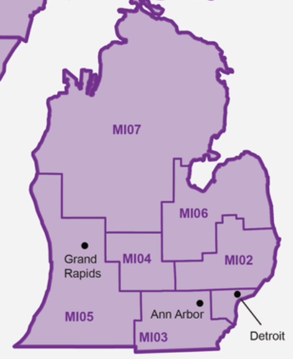

```{r setup, include = F}
options(width = 10000)
knitr::opts_chunk$set(warning = F, message = F, echo = F, comment = '')

library(tidyverse)
library(readxl)
library(leaflet)

scripts_dir <- '.'

eps_data_dir <- file.path('..', 'data', 'eps_market')
eps_image_dir <- file.path('..', 'assets', 'images', 'eps')

shape_dir <- file.path('..', '..', 'cb_geomarket_shape')
```

```{r}
# 2010 zip code to EPS mapping
eps_zip <- read_excel(path = file.path(eps_data_dir, 'eps.xls'), sheet = 'Sheet 1', col_names = T) %>% 
  mutate(eps = if_else(str_sub(eps, 3, 3) == '0', str_c(str_sub(eps, 1, 2), ' ', str_sub(eps, 4, 4)), eps))

# Zip code shapes (2010)
load(file.path(eps_data_dir, 'zcta_2010.RData'))
eps_zcta <- zcta_2010 %>% merge(y = eps_zip, by.x = 'ZCTA5', by.y = 'zip', all.x = T) %>% 
  sf::st_as_sf()

# EPS shapes derived from zip codes
load(file.path(eps_data_dir, 'eps_shapes.RData'))

# Tract shapes
load(file.path(shape_dir, 'analysis_data', 'allyr_anal_tract_sf.RData'))

# EPS shapes (1980)
load(file.path(eps_data_dir, 'eps_shapes_1980.RData'))

# EPS shapes (2000)
load(file.path(eps_data_dir, 'eps_shapes_2000.RData'))

# EPS shapes (2020)
load(file.path(eps_data_dir, 'eps_shapes_2020.RData'))

# County shapes (2020)
load(file.path(eps_data_dir, 'counties_2020.RData'))
```

```{r}
plot_map <- function(state_fips, eps_codes, palette = RColorBrewer::brewer.pal(11, 'Spectral')) {

  m <- leaflet() %>% 
    addProviderTiles(providers$CartoDB.Positron) %>% 
    addPolygons(data = counties_2020 %>% filter(STATEFP %in% state_fips), label = ~NAMELSAD, color = 'gray', weight = 1, group = 'Counties')
  
  bbox <- sf::st_bbox(eps_geometry_zcta %>% filter(eps %in% eps_codes)) %>% as.vector()
  
  for (i in seq_along(eps_codes)) {
    m <- m %>% 
      addPolygons(data = eps_zcta %>% filter(eps == eps_codes[[i]]), label = ~paste0('<b>', eps, '</b>: ', NAME) %>% lapply(htmltools::HTML), color = if_else(i %in% 5:7, '#c4c4c4', palette[[i]]), fillColor = palette[[i]], weight = 1, group = 'EPS from 2010 zip codes') %>% 
      addPolygons(data = allyr_anal_tract_sf %>% filter(eps == eps_codes[[i]], year == '1980'), label = ~paste0('<b>', eps, '</b>: ', gisjoin) %>% lapply(htmltools::HTML), color = if_else(i %in% 5:7, '#c4c4c4', palette[[i]]), fillColor = palette[[i]], weight = 1, group = 'EPS from 1980 tracts') %>% 
      addPolygons(data = allyr_anal_tract_sf %>% filter(eps == eps_codes[[i]], year == '2000'), label = ~paste0('<b>', eps, '</b>: ', gisjoin) %>% lapply(htmltools::HTML), color = if_else(i %in% 5:7, '#c4c4c4', palette[[i]]), fillColor = palette[[i]], weight = 1, group = 'EPS from 2000 tracts') %>% 
      addPolygons(data = allyr_anal_tract_sf %>% filter(eps == eps_codes[[i]], year == '2020'), label = ~paste0('<b>', eps, '</b>: ', geoid) %>% lapply(htmltools::HTML), color = if_else(i %in% 5:7, '#c4c4c4', palette[[i]]), fillColor = palette[[i]], weight = 1, group = 'EPS from 2020 tracts')
  }
  
  m <- m %>% 
    addPolylines(data = eps_geometry_zcta %>% filter(eps %in% eps_codes), color = 'black', opacity = 1, weight = 2, group = 'EPS from 2010 zip codes') %>% 
    addPolylines(data = eps_1980 %>% filter(eps %in% eps_codes), color = 'black', opacity = 1, weight = 2, group = 'EPS from 1980 tracts') %>% 
    addPolylines(data = eps_2000 %>% filter(eps %in% eps_codes), color = 'black', opacity = 1, weight = 2, group = 'EPS from 2000 tracts') %>% 
    addPolylines(data = eps_2020 %>% filter(eps %in% eps_codes), color = 'black', opacity = 1, weight = 2, group = 'EPS from 2020 tracts') %>% 
    addLayersControl(
      position = 'bottomleft',
      overlayGroups = c('EPS from 2010 zip codes', 'EPS from 1980 tracts', 'EPS from 2000 tracts', 'EPS from 2020 tracts', 'Counties'),
      options = layersControlOptions(collapsed = F)
    ) %>% 
    fitBounds(bbox[1], bbox[2], bbox[3], bbox[4]) %>% 
    hideGroup('EPS from 1980 tracts') %>% 
    hideGroup('EPS from 2000 tracts') %>% 
    hideGroup('EPS from 2020 tracts') %>% 
    hideGroup('Counties')
  
  m
}
```

```{r}
source(file.path(scripts_dir, 'metro_eps_codes.R'))

all_codes <- list(
  philadelphia = list(name = 'Philadelphia', eps = philly_eps_codes),
  dallas = list(name = 'Dallas', eps = dallas_eps_codes),
  atlanta = list(name = 'Atlanta', eps = atl_eps_codes),
  chicago = list(name = 'Chicago', eps = chi_eps_codes),
  cleveland = list(name = 'Cleveland', eps = cleveland_eps_codes),
  northern_new_jersey = list(name = 'Northern New Jersey', eps = nj_north_metro_eps_codes),
  houston = list(name = 'Houston', eps = houston_eps_codes),
  bay_area = list(name = 'Bay Area', eps = bay_area_eps_codes),
  long_island = list(name = 'Long Island', eps = long_island_eps_codes),
  new_york_city = list(name = 'New York, New York', eps = nyny_metro_eps_codes),
  detroit = list(name = 'Detroit', eps = detroit_eps_codes),
  boston = list(name = 'Boston', eps = boston_eps_codes),
  miami = list(name = 'Miami', eps = miami_eps_codes),
  dc_maryland_virginia = list(name = 'DMV', eps = dmv_eps_codes),
  orange_county = list(name = 'Orange County', eps = orange_county_eps_codes),
  san_diego = list(name = 'San Diego', eps = san_diego_eps_codes),
  los_angeles = list(name = 'Los Angeles', eps = los_angeles_eps_codes)
)

for (metro in all_codes[order(names(all_codes))]) {
  writeLines(str_c(metro$name, ': ', str_c(metro$eps, collapse = ', ')))
}
```


# Atlanta

- **GA 1**: Cherokee, Cobb, and Douglas Counties
- **GA 2**: Fulton County
- **GA 3**: DeKalb and Gwinnett Counties
- **GA 4**: Clayton, Fayette, Henry, and Rockdale Counties

```{r}
plot_map('13', all_codes$atlanta$eps)
```

<details>
  <summary>**EPS geomarket map**</summary>
  {height=300px}
  {height=300px}
</details><br>


# Bay Area

- **CA 4**: Marin County
- **CA 5**: San Francisco County
- **CA 6**: Contra Costa County
- **CA 7**: City of Oakland
- **CA 8**: Alameda County excluding Oakland
- **CA 9**: San Mateo County
- **CA10**: City of San Jose
- **CA11**: Santa Clara County excluding San Jose

```{r}
plot_map('06', all_codes$bay_area$eps)
```

<details>
  <summary>**EPS geomarket map**</summary>
  {height=300px}
  {height=300px}
</details><br>


# Boston

- **MA 6**: Boston and Cambridge
- **MA 8**: Lowell, Concord, and Wellesley
- **MA10**: Milton, Lexington, and Waltham

```{r}
plot_map('25', all_codes$boston$eps)
```

<details>
  <summary>**EPS geomarket map**</summary>
  {height=250px}
  {height=250px}
</details><br>


# Chicago

- **IL 7**: Chain of Lakes
- **IL 8**: Northwest Suburbs
- **IL 9**: North Shore
- **IL10**: Evanston and Skokie
- **IL11**: City of Chicago
- **IL12**: Western Suburbs
- **IL13**: South and Southwest Suburbs

```{r}
plot_map('17', all_codes$chicago$eps)
```

<details>
  <summary>**EPS geomarket map**</summary>
  {height=350px}
  {height=350px}
</details><br>


# Cleveland

- **OH 2**: North Central Ohio
- **OH 3**: City of Cleveland (West)
- **OH 4**: City of Cleveland (East)
- **OH 5**: Cuyahoga, Geauga, and Lake Counties
- **OH 6**: Northeast Ohio

```{r}
plot_map('39', all_codes$cleveland$eps)
```

<details>
  <summary>**EPS geomarket map**</summary>
  {height=300px}
  {height=300px}
</details><br>


# Dallas

- **TX19**: City of Dallas
- **TX20**: City of Fort Worth
- **TX21**: Irving, Arlington, and Grand Prairie
- **TX22**: Dallas County excluding City of Dallas
- **TX23**: Collin and Rockwall Counties
- **TX24**: Counties West of Dallas/Ft. Worth Metroplex

```{r}
plot_map('48', all_codes$dallas$eps)
```

<details>
  <summary>**EPS geomarket map**</summary>
  {height=250px}
  {height=250px}
</details><br>


# DMV

- **DC 1**: District of Columbia
- **MD 2**: Montgomery Metropolitan
- **MD 3**: Central Maryland excluding Baltimore
- **MD 5**: Prince Georges Metropolitan
- **MD 7**: Baltimore (Urban)
- **VA 1**: Arlington and Alexandria
- **VA 2**: Fairfax County

```{r}
plot_map(c('11', '24', '51'), all_codes$dc_maryland_virginia$eps)
```

<details>
  <summary>**EPS geomarket map**</summary>
  {height=200px}
  {height=200px}
  {height=200px}
  {height=200px}
</details><br>


# Detroit

- **MI 1**: Wayne County
- **MI 2**: Detroit's Northern Suburbs
- **MI 3**: Ann Arbor

```{r}
plot_map('26', all_codes$detroit$eps)
```

<details>
  <summary>**EPS geomarket map**</summary>
  {height=300px}
  {height=300px}
</details><br>


# Houston

- **TX15**: Northwest Houston and Conroe School District
- **TX16**: Southwest Houston Metro Area
- **TX17**: City of Houston (East)
- **TX18**: Galveston and East Harris Counties

```{r}
plot_map('48', all_codes$houston$eps)
```

<details>
  <summary>**EPS geomarket map**</summary>
  {height=300px}
  {height=300px}
</details><br>


# Long Island

- **NY16**: Southern Nassau County
- **NY17**: Northern Nassau County
- **NY18**: Central Nassau County
- **NY19**: Northwest Suffolk County
- **NY20**: Southwest Suffolk County
- **NY21**: East Suffolk County

```{r}
plot_map('36', all_codes$long_island$eps)
```

<details>
  <summary>**EPS geomarket map**</summary>
  {width=400px}
</details><br>


# Los Angeles

- **CA14**: San Fernando Valley (West)
- **CA15**: San Fernando Valley (East)
- **CA16**: Glendale and Pasadena
- **CA17**: West Los Angeles and West Beach
- **CA18**: Hollywood and Wilshire
- **CA19**: East Los Angeles
- **CA20**: South Bay
- **CA21**: South and South Central Los Angeles
- **CA22**: Long Beach
- **CA23**: Covina and West Covina
- **CA27**: Riverside, San Bernardino, and Ontario

```{r}
plot_map('06', all_codes$los_angeles$eps)
```

<details>
  <summary>**EPS geomarket map**</summary>
  {height=300px}
  {height=300px}
  {height=300px}
  {height=300px}
</details><br>

**Notes**:

- Check intersection of CA18, CA19, CA21 for 2000
- Check intersection of CA20 and CA22 for 1980 and 2000


# Miami

- **FL 5**: Broward, Martin, and Palm Beach Counties
- **FL 6**: Dade County
- **FL 7**: Collier, Hendry, and Monroe Counties

```{r}
plot_map('12', all_codes$miami$eps)
```

<details>
  <summary>**EPS geomarket map**</summary>
  {height=300px}
  {height=300px}
</details><br>


# New York

- **NY14**: Staten Island
- **NY15**: Westchester County
- **NY22**: Southeast Brooklyn
- **NY23**: West Brooklyn
- **NY24**: Northeast Brooklyn
- **NY25**: East Bronx
- **NY26**: West Bronx
- **NY27**: Manhattan
- **NY28**: South Queens
- **NY29**: Northwest Queens
- **NY30**: Northeast Queens

```{r}
plot_map('36', all_codes$new_york_city$eps)
```

<details>
  <summary>**EPS geomarket map**</summary>
  {width=400px}
</details><br>


# Northern New Jersey

- **NJ 4**: Middlesex County
- **NJ 6**: Somerset and Mercer Counties
- **NJ 7**: Union County
- **NJ 8**: Essex and Southern Passaic County
- **NJ 9**: Hudson County
- **NJ10**: Bergen County
- **NJ11**: Morris and Northern Passaic County

```{r}
plot_map('34', all_codes$northern_new_jersey$eps)
```

<details>
  <summary>**EPS geomarket map**</summary>
  {height=300px}
  {height=300px}
  {height=300px}
</details><br>


# Orange County

- **CA24**: Whittier and North Orange County
- **CA25**: Anaheim
- **CA26**: Santa Ana
- **CA28**: South Orange County

```{r}
plot_map('06', all_codes$orange_county$eps)
```

<details>
  <summary>**EPS geomarket map**</summary>
  {height=300px}
  {height=300px}
  {height=300px}
  {height=300px}
</details><br>


# Philadelphia

- **PA 1**: Bucks County
- **PA 2**: Chester County
- **PA 3**: Delaware County
- **PA 4**: Montgomery County
- **PA 5**: Philadelphia County

```{r}
plot_map('42', all_codes$philadelphia$eps)
```

<details>
  <summary>**EPS geomarket map**</summary>
  {height=250px}
  {height=250px}
</details><br>


# San Diego

- **CA29**: North San Diego County excluding San Diego
- **CA30**: South San Diego County excluding San Diego
- **CA31**: City of San Diego

```{r}
plot_map('06', all_codes$san_diego$eps)
```

<details>
  <summary>**EPS geomarket map**</summary>
  {height=300px}
  {height=300px}
</details><br>
