\pagenumbering{roman}
\newpage

**ABSTRACT**

```{r setup, echo=F}
knitr::opts_chunk$set(echo = F, message = F, warning = F)
```

```{=html}
<!-- 

The Structure of College Choice (1983) created "Geomarkets" and the "Market Segment Model." Geomarkets carve metropolitan areas into smaller geographies that define local recruiting markets. The Market Segment Model predicts demand for a college in a Geomarket as a function of socioeconomic characteristics. Geomarkets became an input for College Board recruiting products, including their "student list" product, which provides colleges with the contact information of prospective students who meet desired search filter criteria. We draw from scholarship on quantification and address two questions: What is the socioeconomic and racial variation between Geomarkets? How does the socioeconomic and racial composition of included versus excluded prospects vary if student list purchases filter on Geomarkets? We answer RQ1 using Census data and RQ2 using data from actual student list purchases. Geomarket borders are highly correlated with race and class. Student list purchases that exclude low-income Geomarkets systematically overlook high-scoring non-White and first-generation students.

*The Structure of College Choice* [@RN4982] created "Geomarkets" and the "Market Segment Model" (MSM). Geomarkets carve states and metropolitan areas into smaller geographic units to define local recruiting markets. MSM predicts how student demand for a college varies by Geomarket, based on household socioeconomic characteristics. Geomarkets became an input for two College Board recruiting products. First, the Enrollment Planning Service informs which Geomarkets and high schools a college recruits from. Second, the Student Search Service sells prospective student contact information -- or "student lists" -- which colleges filter by Geomarket to determine which prospect profiles to purchase. Drawing from scholarship on quantification, particularly discussions of correlation and homophily, we conceptualize how recruiting products incorporate Geomarkets. We address two research questions: What is the socioeconomic and racial variation between Geomarkets? How does the socioeconomic and racial composition of included versus excluded prospects vary when student lists filter on Geomarkets? We answer RQ1 by analyzing Census data from 1980, 2000, and 2020. RQ2 analyzes data on student lists purchased by public universities, collected through public records requests. Using a quantitative case study design with metropolitan areas as cases, descriptive statistics and interactive maps suggest Geomarkets mirror deeply-rooted patterns of racial and class segregation. Moreover, student lists that exclude low-income Geomarkets systematically overlook non-White students, first-generation students, and especially first-generation non-White students. -->
```

\newpage
\pagenumbering{gobble}
\pagenumbering{arabic}

# Introduction

"The College Board," according to its bylaws, "is a not-for-profit membership corporation \ldots \[whose\] purpose \ldots is to serve educational organizations in connection with the transition of students from secondary schools to colleges" [@collegeboard_bylaws]. College Board membership base largely consists of colleges that need to enroll students. To that end, College Board has developed college-facing enrollment management products, built atop their testing platform, that help colleges identify and recruit prospective students, including the Student Search Service and the Enrollment Planning Service. Scholarship has extensively examined College Board's suite of student-facing testing products [e.g., @RN4854] and the effect of these products on college access [e.g., @Goodman2020], but has largely ignored how college-facing enrollment management products structure which prospective students are recruited by which colleges.

This gap in scholarship about the College Board is symptomatic of a broader blind spot in the sociology of college access. Drawing from recent syntheses [see reviews by @RN4873; @RN2377; @RN4517], scholarship on college access centers a familiar set of actors -- students and families, schools, colleges, and policymakers -- and a familiar set of institutional processes, including curriculum/tracking, admissions, financial aid, and transfer. Taken together, this literature focuses on the processes by which students and direct providers (i.e., schools and colleges) interact. By contrast, scholarship has paid far less attention to third-party vendors, products, and infrastructures that sort and classify students on behalf of colleges looking for customers.

Using Geomarkets and Student Search Service as a case, this paper shows how college-facing recruitment infrastructure can sort students in classed and racialized ways based on where they live, thereby structuring college access before admissions begins. The College Board Student Search Service, launched in 1972 [@belkin2019-studata], sells "student lists" containing the contact information or "profiles" of prospective students. Colleges control which prospect profiles they purchase by selecting search filters, such as SAT score, AP score, and state. Purchased profiles subsequently receive brochures, postcards, emails, and targeted social media, designed to push them toward enrollment. Geomarkets, created by @RN4982 in their book *The Structure of College Choice* published by College Board, carve states and metropolitan areas into smaller geographies meant to approximate recruiting territories.

We conceptualize Geomarkets and the Student Search Service using concepts from the market devices literature [@RN5064; @RN4777]. Market devices are tools that calculate, classify, and compare, becoming embedded in products and market transactions. Geomarkets fit this definition. They define recruiting territories and allow colleges to compare those territories based on characteristics relevant to student demand. @RN4982 developed Geomarkets alongside the Market Segment Model, a class-centered account of how student demand varies across recruiting territories. Geomarkets and the Market Segment Model became the basis for the College Board Enrollment Planning Service (EPS) [@RN4980], making these territories actionable for market analysis and recruiting decisions [@eps_whitepaper_2019]. When Geomarkets became a search filter in Student Search Service, they became categories within a selection device [@RN4778]. This transformation matters because a proprietary geography designed to summarize class-differentiated student demand could now be used to include or exclude individual prospective students from recruiting interventions based on their home Geomarket.

Yet the consequences of Geomarket filtering are not fully visible within the Student Search Service interface. When colleges purchase a student list, they observe the profiles generated by the filters they selected, not the counterfactual prospect pools associated with alternative Geomarket selections. The issue is not only that users cannot observe these counterfactuals; it is that a class-centered geography of student demand becomes a supply-side mechanism for distributing recruiting information. Status-attainment research argues that educational achievement and college destinations are patterned by family socioeconomic background [@RN1273]. The undermatching literature argues that many high-achieving, low-income students lack information about their college options [@RN3699]. Neither centers the supply-side market devices through which colleges include or exclude prospective students from receiving marketing information in the first place. If academically similar students from different racial/ethnic and first-generation backgrounds are unevenly distributed across Geomarkets, then Geomarket filtering may alter the composition of the prospect pool made visible to colleges even when test-score criteria are held constant.

Therefore, our overarching research question is: How do Geomarket filters within College Board’s Student Search Service shape the racial/ethnic and first-generation composition of academically similar prospect pools made visible to colleges? We answer the overarching question through specific questions that examine the Geomarket filter from three complementary angles, (1) the categories it defines, (2) the group distributions those categories organize, and (3) the consequences of excluding particular categories from a search:

1.  **What is the composition of each Geomarket?** To what extent do College Board Geomarkets partition academically similar prospects into racially and socioeconomically distinct pools within metropolitan areas?
2.  **Where does each group come from?** Which Geomarkets contribute disproportionately to different racial/ethnic and first-generation-status groups within academically similar prospect pools?
3.  **What happens when a Geomarket is excluded?** How does excluding particular Geomarkets change the composition of the prospect pool made visible to colleges?

We answer these questions using data from actual student lists purchased by public universities, obtained via public records requests. Each observation is the profile of a student that satisfied all search filter criteria in a student list purchase (e.g., HS graduation year, PSAT score range, Geomarket). We assign students to Geomarkets by digitizing Geomarket maps published in @collegeboard_connections_geographies. We analyze student list purchases that include all Geomarkets in a metropolitan area, allowing us to show which prospects would be included or excluded had a purchase filtered on particular Geomarkets. Our analyses therefore demonstrate the racial and socioeconomic consequences of using Geomarkets as a search filter, regardless of which college is purchasing the list.

We utilize a case study design in which each case is a metropolitan area that contains multiple Geomarkets. We present detailed results for Chicago, followed by an overview and selected results from other cases. In Chicagoland, Geomarkets are highly correlated with race and class: the "IL 11 - City of Chicago" Geomarket is the poorest and most racially diverse, while Geomarkets like "IL 9 - North Shore" and "IL 10 - Evanston & Skokie" are more affluent and predominantly White. Analyses of student-list data show that, even after filtering on students in the same test-score range, excluding students from the City of Chicago Geomarket disproportionately excludes Black, Hispanic, and first-generation college students. Although Asian prospects were distributed more evenly across poor and affluent Geomarkets, excluding the poorer "IL 11 - City of Chicago" and "IL 13 - South & Southwest Suburbs" Geomarkets disproportionately excludes first-generation Asian students. We find similar patterns in Dallas and in the additional metropolitan cases we analyze.

These analyses push the sociology of college access to look upstream for mechanisms of social reproduction. Geomarkets were conceived alongside the Market Segment Model, which shares a core premise with status-attainment theory, namely that educational achievement and college-going are patterned by family socioeconomic background. College Board translated @RN4982’s observations about geographically patterned student demand into market infrastructure. EPS made class-differentiated Geomarkets actionable for market analysis, and Student Search Service made them selectable as filters for purchasing prospect names. Whereas extant scholarship treats recruiting as behavior carried out by individual colleges, our case shows that it also depends on third-party market devices that classify students, define markets, and structure which prospects become visible to colleges. This matters because third-party vendors have quietly shaped college access for decades. Their influence is growing as private-equity-backed firms develop software-as-a-service platforms that perform core enrollment management functions [@drew_hansen_2017]. Sociology needs an agenda for studying vendor-mediated educational sorting.

The following section describes the field of enrollment management, reviews scholarship on recruiting, and introduces the case of Geomarkets and the Student Search Service. Second, we introduce concepts from the market devices literature and apply these concepts to motivate empirical analyses. Third, we describe data and methods. Fourth, we present results. Finally, we discuss implications for scholarship.

# Literature and Case

**College access**. Sociology explains inequality in college access through two broad traditions. The status-attainment tradition argues that educational attainment and college destinations are strongly patterned by family socioeconomic background, especially parental education, occupation, and income [@RN1273; @RN915; @RN1239; @RN1272; @jencks1972inequality]. A second tradition, drawing on Bourdieu’s theory of cultural capital [@RN1228; @RN940] and Weberian accounts of status-group competition [@RN865], emphasizes how privileged households and elite institutions reproduce advantage. Bourgeois households transmit classificatory knowledge, feel for the game, and access to social networks that confer access to selective colleges [@RN4991; @RN1814; @Hill2015; @Lee2013] . At the same time, selective colleges are financially and culturally tied to affluent families, alumni, donors, and feeder schools, and they construct admissions and access pathways that disproportionately recognize and reward bourgeois forms of capital [@RN3544; @RN3547; @Armstrong2013; @Rosinger2021; @Alon2009]. Across these traditions, sociology understands higher education less as an engine of social mobility than as a social sieve, regulating access to privileged positions while reproducing class and status-group advantage [@RN2377; @jencks1972inequality].

A related body of scholarship examines how colleges themselves actively shape unequal access to higher education through admissions, financial aid, and recruiting practices. Sociology demonstrates an enduring interest in evaluating admissions processes [@RN3547], with more recent scholarship taking up the implementation of "test optional" policies and holistic admissions [@RN5103; @RN3522]. Interdisciplinary scholarship on financial aid shows how institutional aid, originally justified as a tool for helping low-income students afford college, become a strategic enrollment-management tool for attracting students who improve institutional revenue, rankings, and reputation [@RN1948; @RN2241]. Our manuscript builds most directly on a smaller literature on recruiting, which examines how colleges identify, cultivate, and solicit the prospective students they hope to convert into applicants. Ethnographies by @RN3519 and @RN4407 identify connections between private school guidance counselors and college admissions officers as a mechanism for social reproduction. In turn, recruiting visits to high schools are a means of maintaining ties with guidance counselors at feeder schools [@RN3519; @RN4895]. Quantitative case-studies of off-campus recruiting visits by public research universities and by selective private universities reveal a preference for visiting private schools and affluent, predominantly White public schools [@RN4758_blinded; @RN4759_blinded; @RN5023_blinded]. From the student perspective, @RN4324 finds that underrepresented students were drawn to colleges that made them feel wanted, often attending institutions with lower graduation rates and requiring larger loans than other college options. @cottom2017lower shows that for-profit colleges found a niche in Black and Latinx communities because traditional colleges ignored these communities.

Although sociology of education offers metaphors of sorting machines, sieves, and inequality regimes to describe college access [@RN4873; @RN2377], it under-specifies the commercial tools and infrastructures through which sorting is operationalized. We argue that this blind spot stems from the tendency to treat colleges as protagonists, yielding scholarship that treats enrollment practices as activities carried out by individual institutions. Yet the enrollment management industry also includes professional associations (e.g., National Association for College Admission Counseling) and third-party servicers that supply products, data, and consulting solutions to colleges (e.g., College Board, EAB). College access may be structured by third-party products that colleges purchase to identify and recruit prospective students. Despite the growing role of these intermediaries, scholarship on college access has rarely made third-party servicers and enrollment products the object of empirical analysis [but see @RN5039]. This manuscript focuses on products that sell the contact information of prospective students.

```{=html}
<!-- CUT TEXT
The enrollment management (EM) profession integrates techniques from marketing and economics in order to "influence the characteristics and the size of enrolled student bodies" [@RN2771, p. xiv]. The "enrollment funnel" -- prospects, leads, inquiries, applicants, admits, enrolled students -- is an industry-standard conceptual heuristic that modifies the traditional marketing funnel to depict broad stages in the process of recruiting students [@RN4986; @RN2004]. The funnel begins with a large pool of "prospects" (i.e., prospective students) that the university would like to enroll. "Leads" are prospects whose contact information has been obtained. "Inquiries" are prospects that contact the institution, including those that respond to an initial solicitation (e.g., email) and those that reach out on their own (e.g., sending SAT scores). The purpose of the enrollment funnel is to inform recruiting interventions that increase the probability of "conversion" across stages [@RN4322]. Scholarship at the nexus of EM and college access can be categorized by which part(s) of the enrollment funnel it speaks to. The majority of scholarship focuses on the admissions stage, analyzing which admissions criteria are utilized and/or which applicants are admitted [e.g., @RN4874; @RN4993; @RN4131; @RN3522; @poon2022rethinking]. Scholarship from the economics of education often investigate financial aid leveraging, which seeks to convert admits to enrolled students [e.g., @RN3133; @RN3762].
The funnel narrows at each successive stage in order to convey the assumption of "melt" (e.g., a subset of "inquiries" will apply).
As an administrative structure, the EM office typically controls the activities of admissions, financial aid, and recruiting [@RN2406]. The enrollment management industry incorporates relevant actors in the organizational field, including professional associations (e.g., National Association for College Admission Counseling), and third-party servicers (e.g., College Board, EAB) that supply products and consulting solutions to colleges.-->
```

**Student lists**. In the practitioner-oriented enrollment management industry, the "enrollment funnel" modifies the traditional marketing funnel to depict broad stages -- prospects, leads, inquiries, applicants, admits, enrolled students -- in the process of recruiting students [@RN4986; @RN2004]. The funnel begins with a large pool of "prospects" (i.e., prospective students) that the university would like to enroll. "Leads" are prospects whose contact information has been obtained. "Inquiries" are prospects that contact the institution, including those that respond to an initial solicitation (e.g., email) and those that reach out on their own (e.g., sending SAT scores). The purpose of the enrollment funnel is to inform recruiting interventions that increase the probability of "conversion" across stages [@RN4322].

At the top of the enrollment funnel, purchasing student lists is the primary means of converting prospects to leads [@list_biz_blinded]. A student list contains the contact information of prospective students who meet the search filter criteria (e.g., test score, GPA) specified by the university. Student lists are the fundamental input for undergraduate recruiting campaigns because purchased names -- alongside prospects who reach out on their own -- constitute the set of prospects who receive subsequent recruiting interventions (e.g., mail, email) designed to push them toward the application and enrollment stages of the funnel. Historically, the dominant student-list vendors have been the College Board and ACT, which sell the Student Search Service and Educational Opportunity Service products, respectively, using data derived from test-takers. However, the test-optional movement, technological change, and entry by private equity-backed firms have intensified competition in the market for student list data [@list_biz_blinded]. @RN4895 reports that 86% of public colleges and 87% of private colleges purchase student lists. For public universities that purchased lists, 80% purchase more than 50,000 names annually \[AND PRIVATES?\]. @RN4896 reports that student lists were the top expenditure item in the undergraduate recruiting budget for both private and public institutions in 2022, with the average public institution allocating 15% of its budget to names.

Student lists are positively associated with student outcomes. A College Board research report by @RN4739 compared SAT test-takers who opted into the College Board Student Search Service -- allowing colleges to purchase their contact information -- to those who opted out. After controlling for covariates (e.g., SAT score, parental education, school fixed effects), 41.1% of students who participated in Search attended a 4-year college compared to 32.8% of students who opted out, an 8.3 percentage point difference and a 25.3 percent change -- $(41.1–32.8)/32.8$ -- in the relative probability.[^1] @RN4739 also found that participating in Search was strongly associated with obtaining a BA in four years.[^2]

[^1]: Leveraging a natural experiment in College Board student list purchases, @RN4894 find that purchasing a prospect profile increases the probability that the student will apply to and enroll at the purchasing college, with larger effects for Black, Hispanic, and low-income students.

[^2]: 20.6% of students who participated in Search obtained a BA in four years compared to 15.7% of students who opted out, representing a 31.2% (=(20.6-15.7)/15.7) increase in the relative probability of graduation.

```{=html}
<!-- CUT TEXT
^[Participating in Search was associated with a larger change in the relative probability of attending a 4-year college for Black students (24.5%) and Hispanic students (34.4%) than White students (21.6%), and a larger change for students whose parents did not attend college (40.6%) than those whose parents had a bachelor’s degree (18.9%).] 

@RN4739 also found that participating in Search was strongly associated with obtaining a BA in four years, particularly for sub-groups that were historically excluded from college.^[. Furthermore, the relative increase in the probability of obtaining a BA was higher for Black (40.3%), Hispanic (43.3%), and Native American/Alaska Native students (48.3%) than it was for White (27.9%) and Asian (28.2%) students. The relative increase was also higher for students whose parents did not attend college (50.0%) than it was for students whose parents had a BA (25.3%).]
-->
```

However, @RN5012_blinded argue that student list products may exacerbate racial inequality in college access. "Selection devices" are routines for making decisions about who receives an intervention [@RN4778]. Student list products are selection devices that enable colleges to select prospects by incorporating search filters (e.g., high school graduating class, state). @RN4786 defines "racialized inputs" as ostensibly race-neutral inputs that are systematically correlated with race because marginalized racial/ethnic groups have historically been excluded from the input. @RN5012_blinded argue that several frequently utilized student list filters (e.g., zip code, AP test score, SAT score) meet the criteria of racialized inputs. Using a national sample of high school students and using data from actual student lists purchased by public universities, @RN5012_blinded show that racialized search filters have a strong negative relationship with the selection of Black and Latinx prospects.

Because of the extent of residential segregation in the U.S., geographic borders are a commonly studied racialized input in scholarship about algorithmic bias [@RN4775; @RN4849; @RN4887]. Student list products offer many geographic filters. Some geographic filters are based on known geographic borders (e.g., zip code, county, CBSA, state). College Board also created proprietary geographic borders that became filters in the Student Search Service, such as Geomarkets and Geodemographic Segment filters. In their sample, @RN5012_blinded found that 13% of student lists purchased by public research universities filtered on Geomarkets. Drawing from @RN4786, we argue that geomarkets satisfy the two criteria of racialized inputs. First, they are ostensibly race-neutral inputs in that neither @RN4982 -- nor subsequent EPS promotional material [e.g., @RN1621] -- mention race. Second, Geomarkets may be systematically correlated with race. For example, Geomarket "CA07" is "City of Oakland" and "CA08" is "Alameda County, excluding Oakland." We extend @RN5012_blinded by examining the racial and socioeconomic consequences of Geomarket filtering.

```{=html}
<!-- 
load('../public_requests_eda/data/combined_data.RData')

# 414 orders (filtering orders that have lists + not MN univs)
orders_df %>% filter(order_num %in% lists_df$order_no, !univ_id %in% c('174358', '174075')) %>% mutate(has_geomarket = !is.na(geomarket)) %>% group_by(has_geomarket) %>% summarise(n = n())

52 / 414 = 13% of orders used geomarket filter
-->
```

## The Case: Geomarkets and The Market Segment Model

Several of College Board's college-facing enrollment management products (e.g., Admitted Student Questionnaire) developed from collaborations between College Board and member institutions. In 1978, amidst concern about declining demographics, the president of UPenn tasked UPenn professor Robert Zemsky, to figure out, "'Who thinks about Penn?'" and "'What other institutions do they think about when they think about us?'" [@RN4982, p. x]. To answer these questions, Zemsky began working with the Market Research Committee of the Consortium of Financing Higher Education (COFHE), a consortium of 30 selective private universities. The COFHE working group adopted the lofty goal of predicting student demand for any college from any locality. However, "to gain a truly comprehensive view of the collegiate enrollment market, we needed a database that described most institutions and most students \ldots Coincidentally, the Board was reviewing its own efforts to help colleges estimate their enrollment potential, efforts which had faltered largely because the smallest demographic unit used in these analyses was the state" [@RN4982, p. x]. College Board provided funding and SAT score-sending data, then published *The Structure of College Choice* by Zemsky and Oedel in 1983.

Conceptually, @RN4982 describe the Market Segment Model as an effort to "capture and quantify" (p. 11) the knowledge of admissions officers: "we believe that the intuitions of admissions officers actually comprise a remarkably systematic body of knowledge about the college selection process\ldots Our research is based upon listening carefully to what admissions officers have to say" (pp. 9-10). <!-- Quoting an admissions officer, @RN4982 \[p. 11\] write, "'There are only three kinds of college-bound students: those who want to live at home, those who want to live on campus but bring their laundry home, and those who want to go far enough from home that Mom and Dad can't visit without calling first.'"  -->

Analytically, the "initial task" was to define geographic boundaries "in a manner consistent with admissions officers' intuitive understanding of student pools" [@RN4982, p. 4]. As such, @RN4982 \[p. 11\] created "three types of boundaries -- region, state, and community." The initial regions in the project were New England, Middle States, and the South. Next, they "divided each state into as few as two and as many as thirty community-based enrollment markets or pools, for a total of 143 separate markets" (p. 11). These enrollment markets, later called Geomarkets, were intended to reflect admissions counselors’ own understandings of catchment markets. @RN4982 [pp. 11-12] described the creation of Geomarket borders briefly:

> In many cases, the market boundaries match formal political and educational divisions, reflecting natural channels of communication. Each major metropolitan area is composed of several markets, usually corresponding to the inner city, a first ring of suburbs, and an outer ring of suburbs. <!-- In more sparsely populated areas, communities are sometimes combined in order to make the analysis meaningful. -->

The Market Segment model was "nothing more than a set of simple rules for disaggregating high school seniors into similar groups" based on SAT score-sending behavior [@RN4982, p. 4]. For a given test-taker, each college that receives a score from the student can be defined as "local" (college located in the the same Geomarket as the student), "in-state" (same state but different Geomarket), "regional" (same region but different state), or "national" (different region). Each student was then classified into one of four student market segments, local, in-state, regional, and national. A "local" student is one that submits more SAT to local institutions than they do to in-state, regional, or national institutions. An "in-state" student submits more SAT scores to in-state institutions than they do to local, regional, or national institutions, etc. The model states that students in the local market segment are considering colleges in their home Geomarket, in-state students are willing to consider colleges in colleges in their home state, regional students are willing to consider out-of-state colleges in nearby states, etc. "The model worked because students, once so disaggregated, appeared to behave in remarkably consistent ways" [@RN4982, p. 4]

The Market Segment Model yielded tautological, yet powerful recommendations for college recruiting efforts. A community college should concentrate recruiting efforts on students in the local market segment who live in the same Geomarket as the college. Regional state colleges and non-selective private colleges should focus on students from the local an in-state market segments. Selective private colleges and public universities looking for out-of-state students should focus on students from the regional and national market segments.

@RN4982 identify four variables -- parental education, family income, scholastic aptitude, and educational aspirations -- that predicted whether a student belongs to the local, in-state, regional, or national market segment. The resulting thesis is that student demand for college is a substantially a function of social origin: "these four attributes \ldots reflect the basic social patterns of the nation; it would have been surprising if these were not the four social variables that best explained the patterns of college choice" [@RN4982, p. 33]. The analyses conclude (p. 42) that "our research has simply demonstrated what everyone has always known: communities with high levels of family income and parental education are also communities in which students have higher than average SATs and more far-reaching aspirations."

However, Geomarkets differ in the relative abundance of students with particular socioeconomic characteristics. As college leaders sought new sources of patronage, the Market Segment Model yielded implications about which communities to target. @RN4982 [p. 44] recommend that colleges target Geomarkets with desirable compositions of socioeconomic characteristics in order to reach students from desired student market segments:

> On occasion, senior spokespersons for the profession worry that students outside the main \[Geo\]market areas remain forgotten and hence, unchallenged. Inevitably, the increasing competition for students, the expense of travel and mailings, and internal political constraints compel institutions to concentrate their efforts where they will do the most good. The result is a natural reinforcing of the basic socioeconomic patterns that gave shape in the first place to the structure of college choice.

In 1984, the logic and analytic outputs associated with the Market Segment Model became the basis for the College Board Enrollment Planning Service (EPS), an early software-as-service product sold to colleges. EPS also provided information about the score-sending behavior of individual high schools within each Geomarket [@eps_whitepaper_2019]. Market research suggests that EPS was highly salient. @RN5021 reports that in 1995, 37% of 4-year publics and 49% of 4-year privates used EPS, while 41% of 4-year publics and 16% of 4-year privates used ACT's market analysis service product. @RN5019 marketing material describes EPS as, "the marketing software that pinpoints the schools and Geomarkets where your best prospects are most likely to be found. With the click of a mouse, EPS provides you with comprehensive reports on your markets, your position in those markets, and your competition." Following @RN4982, the EPS platform encouraged users to, first, identify promising Geomarkets and, second, to identify desirable high schools for recruiting visits. To find new markets, EPS encouraged colleges to select peer colleges and identify Geomarkets where a large number of students sent scores to those colleges. <!-- ^[@RN4982 developed two analytic outputs, (1) the Market Segment Profile and (2) the Institutional Profile. The Market Segment profile showed -- separately by Geomarket -- the number of students from each market segment (local, in-state, regional, national), their socioeconomic characteristics, and average test scores. The Institutional Profile showed -- separately by Geomarket and institution (your own or a competitor) -- how many students from each market segment sent scores to that institution. EPS enables a college to obtain -- for any Geomarket -- the the Market Segment Report and the Institutional Profile for themselves or a competitor.] -->

Geomarkets also became a search filter in the Student Search Service, College Board's most popular college-facing product [@RN4980]. @eps_whitepaper_2019 promotional material describe EPS as a tool to help colleges refine their student list purchases. @RN4982 [pp. 42-44] describe how the Market Segment Model guides decisions about which Geomarkets to target, including decisions about student list purchases.

> Imagine you recruit for a college that draws most of its students from regional or national segments. Where would you concentrate your energies? Ideally, you would seek communities \[Geomarkets\] with a high proportion of students already predisposed toward institutions such as your own. The Market Segment Model would provide this information through segment percentages for the community in question. **Further classification of students by social attributes allows you to identify a group for mailings**\ldots If you were to recruit in Boston, only about two out of every ten students with fewer than two attributes would likely listen\ldots Your efforts would be better directed toward\ldots Manchester, Hartford, and Fairfield County \ldots Indeed, in Fairfield County alone you could reach more than 40 percent of your "primary target" population \[bold added\].

As context, median household income in 1980 (expressed in 2024 CPI) for the relevant Geomarkets was \$63,583 for "MA06 -- Boston and Cambridge," \$81,919 for "NH02 -- Merrimack Valley (Manchester), \$89,484 for "CT05 -- Hartford and Tolland County," and \$105,633 for "CT03 -- Fairfield County" (author calculations based on 1980 Decennial Census and digitized Geomarket boundaries).

# Theoretical Framework: Market Devices

```{=html}
<!-- OG FIRST PARAGRAPH and CUT PARAGRAPH
Core concepts in the market devices literature are market devices, agencement, and performativity. 
Market devices are the assemblage of techniques, theories, and culture that make economic action possible [@callon1998embeddedness]. Drawing from Krippner’s [-@RN5070] study of insurance, an example of a market device is the statistical models that assign individuals to "risk pools" for insurance products. Market devices shift scholarly attention to the individual components -- including techniques, theories, cultural logics, and histories -- that are foundational to products and to markets [@RN5071] The analysis of market devices in insurance also includes the long history of mutualism that the insurance industry emerges from. Market devices are also useful because they shift source of social inequality from organizations to markets. @RN5070 argues that the statistical models underlying insurance products are "gendered market devices" because gender is one of the variables used to assign people to different risk pools.

Emerging from French approaches to economic sociology and science and technology studies (STS), the market devices literature directs scholarly attention to (1) the heterogeneous components that constitute markets -- including techniques, theories, cultural logics, and historical legacies, (2) the ways actors engage with and enact these components in practice, and (3) the consequences of these engagements for how markets are organized, stabilized, and transformed [@callon1998embeddedness; @RN5064; @RN5067].
-->
```

We conceive of Geomarkets and the Student Search Service product as examples of "market devices." Market devices are tools that calculate, compare, and classify (e.g., algorithms, metrics, rankings) that become incorporated into products and transactions "that make economic action possible" [@RN4777, p. 1176]. @RN5064 [p. 2] define market devices as a "way of referring to the material and discursive assemblages that intervene in the construction of markets."

<!--# KS CUT: Unpacking this, material refers to tangible tools and technologies, like spreadsheets, algorithms or software, while discursive refers to representational elements, such as categorical, quantitative, and ordinal variables. Assemblages refers to a bundle of heterogeneous components that work together, suggesting that market devices consist of and build upon other market devices.-->

Market devices are non-neutral because they shape what actors can do and what they can see. Therefore, markets do not exist a priori waiting to be observed; they are constructed by market devices [@RN5064]. The "affordances" of a market device are the practical actions the device enables, including built-in options, settings, and outputs that enable users to do some things more easily than others. In Student Search Service, the relevant affordance is the ability to include or exclude prospects using predefined filters. "Framing" refers to how the devices constructs the decision situation, including what is rendered visible, eligible, and meaningful for action. In Student Search Service, the relevant frame is the purchased list of prospects that satisfied all search criteria. Here, users observe who appears in the selected list, not the counterfactual pools associated with alternative filter choices.

<!--#  KS CUT/OLD VERSION: From a market devices perspective, the potential harm of affordances is itself empirically important. Rather than focusing on the presence or prevalence of unequal outcomes, the relevant question is whether market devices produce classifications and affordances to make such outcomes possible and actionable.This logic is consistent with scholarship on digital discrimination, which has increasingly shifted focus from analyzing observable downstream outcomes (e.g., denied job or loan) to examining mechanisms with the potential for harm, risk, or exclusion. Research on algorithmic bias demonstrates how the design of platforms and classification systems can create opportunities for disparate treatment before any specific discriminatory intent is observed.  For instance, scholars have identified algorithmic "ratchet effects" [@RN4851] or "pernicious feedback loops" [@RN4849] as critical mechanisms for harm by using past outputs as inputs for future predictions, such as predictive policing systems using crime-data from historically over-policed neighborhoods to subsequently identify those same communities for additional surveillance and intervention [@RN4887]. The concern, therefore, is not solely on whether discriminatory outcomes can be observed in a particular instance, but whether the market device creates stratified affordances based on racial and socioeconomic classification in ways that render differential treatment as a routine organizational practice.  -->

This logic is consistent with scholarship on data-driven discrimination, which examines the potential for harm embedded in a data system's affordances. Research on algorithmic bias demonstrates how seemingly neutral data systems can create opportunities for disparate treatment before discriminatory intent is observed. For instance, predictive policing systems can generate "ratchet effects" [@RN4851] or "pernicious feedback loops" [@RN4849] using crime-data from historically over-policed neighborhoods to subsequently identify those same communities for additional surveillance and intervention [@RN4887]. The concern, therefore, is not on whether discriminatory outcomes can be observed, but whether the market device creates stratified affordances based on racial and socioeconomic classification that render differential treatment as a routine organizational practice.

However, in the market devices framework, neither market devices nor actors have agency in isolation. Agencement refers to an arrangement that creates capacity for action. It is a configuration of devices, people, organizational goals, routines, and incentives that makes some courses of action available, recognizable as choices, and more likely than others [@RN5102]. Consider a public research university in the South facing prolonged state disinvestment, has strong enrollment demand in the South and Southwest and decides to prioritize nonresident enrollment growth as a means of pursuing the enrollment goals of tuition revenue and academic profile. Agencement is the arrangement linking state disinvestment, enrollment goals, Student Search Service filters, recruitment communications, and financial aid leveraging routines. Student Search Service enables the university to purchase prospect pools that are responsive to these financial pressures and enrollment goals. It makes particular actions, such as buying names from particular regions or score bands, available and legible while leaving alternative prospect pools outside the frame of the chosen search.

In themselves, theories (e.g., pricing theory, status attainment theory) are not market devices. They are abstract ideas that can be applied to specific contexts. For example, homophily is the idea that people who share similar characteristics are more likely to connect [@mcpherson2001birds]. Theories become part of market devices when components of the theory are embedded within the device. Commercial social networks like Twitter/X incorporate friend-and-follow recommendation algorithms -- market devices -- that make recommendations to users based on similarity metrics (e.g., shared attributes, behaviors, network positions) that are based on logic of homophily [@RN4975]. Thus, theories become consequential when components of them are embedded in market devices. This is the core insight of the market devices concept, performativity [@callon2007economics_performative]. Theories do not merely describe markets; when operationalized through tools, categories, and routines, they can help organize the behavior they describe [@RN5067]. In our case, the Market Segment Model matters not simply as a theory of student demand, but because its logic and categories -- including Geomarkets -- became embedded in EPS and Student Search Service.

```{=html}
<!-- 
Performativity describes the consequences of market devices. Performativity is the idea that economic theories do not merely describe behavior; rather, when operationalized through market devices, they can bring about behavior consistent with theory. [@RN5064; @RN5067]. The canonical study by @RN5067 provide a historical sociology of the Chicago Board Options Exchange, which opened in 1973. An option is a contract that gives the holder the right to buy or sell an asset (e.g., a stock) at a given price. Economists Fischer Black and Myron Scholes developed the Black-Scholes model to predict the price of options @RN5074, eventually winning the Nobel Prize in Economics. Initially, the model did not accurately predict the price of options. Model predictions became more accurate over time because options traders began embedding the logic and components of the model into spreadsheets/software. That is, the models predictions became more accurate because the model produced the prices it predicted! The findings of @RN1776 provide an example of performativity for the case of US News College Rankings. The reputational assessment of senior administrators was a substantial component of the rankings algorithm. @RN1776 show that administrators based their assessment scores on the prior overall rankings. Therefore, the rankings algorithm disciplines administrators to provide assessments that are consistent with the prior rankings. -->
```

Analysis of the Houston residential real estate market by Korver-Glenn [-@RN4801; -@RN4779], as interpreted by @RN4777, shows how geographic market devices can be a mechanism of racial inequality. Every home listing is a assigned to a Houston Association of Realtors (HAR) "market area" -- a market device akin to Geomarkets -- based on the address of the property. Korver-Glenn shows that HAR market areas were racially uneven in both composition and population size. Majority-White HAR market areas were greater in number but with fewer residents and more socioeconomically homogeneous than majority-Black or majority-Hispanic market areas [@RN4779]. Because appraisals are based on recent comparable sales within the same HAR market area, homes in high-income white neighborhoods received higher appraisal values than homes in high-income Black or Hispanic neighborhoods. College Board Geomarkets often exhibit similar differences in granularity. For example, the affluent, predominantly White "IL 9 - North Shore" Geomarket, had a 2020 population of about 161,000 while "IL 12 - South and Southwest Suburbs" Geomarket had a 2020 population of about 1.2 million.

Although larger than HAR market areas, Geomarket borders may be highly correlated with race and class. Geomarkets translated the class-centered Market Segment Model into a set of recruiting territories. Because Geomarkets often follow the urban core versus suburban ring divisions of metropolitan areas [@RN4982] that correspond to U.S. class segregation [@reardon2011] and racial segregation [@RN4779], we expect Geomarkets in large metropolitan areas to be correlated with both race and class. For example, the affluent, predominantly White "IL 9 - North Shore" Geomarket, had a 2020 population of about 161,000 while "IL 12 - South and Southwest Suburbs" Geomarket had a 2020 population of about 1.2 million. Additionally, some Geomarket boundaries mirror familiar racialized divisions in metropolitan housing markets. Examples include: the "South and South Central Los Angeles" geomarket (CA21); the "City of Oakland" geomarket (CA07), surrounded by the "Alameda County excluding Oakland" geomarket (CA08); and the "Wayne County Detroit" geomarket (MI01), surrounded by the "Detroit's Northern Suburbs" (MI02) and "Ann Arbor" (MI03) Geomarkets.

<!--# cut from paragraph above/repetitive: Like HAR market areas, Geomarkets often exhibit differences in granularity tied to both race and class. -->

<!--# cut from paragraph above/shortened: Whereas some Geomarket boundaries followed formal political or educational divisions, @RN4982 describe metropolitan areas as divided into markets corresponding to “the inner city, a first ring of suburbs, and an outer ring of suburbs” [CITE]. Given the extent of U.S. class segregation [@reardon2011], racial segregation [@RN4779], and the correlation between race and wealth [@RN4786], we expect Geomarkets in large metropolitan areas to be correlated with both race and class. -->

## Application to the case

**Conceptualizing the case**. The case of Geomarket filters within the College Board Student Search Service exemplifies how market devices are built upon existing market devices. "Commensuration" is a process whereby heterogeneous, previously incomparable entities become comparable "according to a common metric" [@RN5063, p. 315]. The SAT enables colleges to compare students across schools [@RN2247], while the Market Segment Model uses SAT score-sending behavior to classify students into market segments. Geomarkets extend this logic by enabling colleges to classify geographic localities according to the market segment composition of students within them.

<!--# KS CUT/shortened: The SAT is a commensurating market device that enables colleges to compare students from different schools [@RN2247]. @RN4982 developed the Market Segment Model on top of this testing platform, using SAT score-sending behavior to classify students into market segments -- local, in-state, regional, and national -- based on the geographic proximity between students and the colleges to which they sent scores. Geomarkets are market devices that define geographic localities and enable colleges to commensurate those localities based on the number of students from each market segment. The Market Segment Model is a theory that predicts demand for a particular college by students from a particular Geomarket as a function of the student market segment composition of the Geomarket. -->

Geomarkets and the logic of the Market Segment Model formed the basis for the Enrollment Planning Service product [@RN4980], which helps colleges decide which Geomarkets to recruit from by making market segmentation actionable. Building on @RN4982, EPS software encourages colleges to select Geomarkets by identifying peer colleges and then identifying Geomarkets where many students sent scores to that college [@eps_whitepaper_2019].<!-- ^[For example, the @eps_whitepaper_2019 EPS "Best Practices and Getting Started" article begins, "Step 1: Get to know the reports \ldots. Spend time reviewing your Executive Summary Reports such as Top Feeder High Schools, Largest Geo-markets of Your Top Competitors, and Competition by Overlap Takers."] --> @eps_snapshot_2022 marketed EPS as a complement to the Student Search Service, describing it as "an analysis and reporting service that enables admission professionals to better understand the student market and the lists they license with Student Search Service."[^3] EPS helped colleges refine the student lists they purchased by providing information about geographic markets, student mobility, and competitor activity.

[^3]: @eps_snapshot_2022 describes tactics to "leverage EPS to grow and refine your recruitment strategies in College Board Search," including: "leverage competitor reports to see where similar institutions may be attracting more students in a target geography to broaden your name licensing using common peer traits" and "Study criteria unique to EPS such as student mobility to identify areas where students are likely to go out of state for college to expand markets."

<!--# KS Cut/Shortened: Geomarkets and the logic of the Market Segment Model formed the basis for the Enrollment Planning Service product [@RN4980], a market device that helps colleges decide which Geomarkets to recruit from. By embedding the logic of the Market Segment Model into EPS, College Board made this approach to market segmentation actionable for enrollment managers. Building on @RN4982, EPS software encourages colleges to select Geomarkets by identifying peer colleges and then identifying Geomarkets where many students sent scores to that college [@eps_whitepaper_2019].  -->

Student Search Service extended the Geomarket/EPS architecture from market analysis to prospect selection. Student Search Service is a selection device [@RN4778; @RN5012] that enables colleges to choose which prospect profiles they purchase by selecting search filters that classify students (e.g., where they live, how well they score on particular tests, etc.). Over time, Student Search Service developed integrations with Geomarkets and EPS. Geomarkets became a search filter in Student Search Service, enabling colleges to purchase the profiles of prospects residing in particular Geomarkets. Thus, Geomarkets moved from describing market territories to helping determine which academically eligible students became purchasable prospects. A student may satisfy the same academic criteria as other students in the search -- year of HS graduation, test-score band — but become invisible to the college if their Geomarket is excluded. This transformation from analytic territory to selection filter motivates the empirical analyses below. <!--In our data collection (described below) of 414 student lists purchased by 11 public research universities, about 16% of student list purchases filtered on Geomarket [CHECK STATS; SAY WHY THIS IS A LOT?]. -->

**Motivating empirical analyses**. Our overarching research question is, how do Geomarket filters within College Board’s Student Search Service shape the racial/ethnic and first-generation composition of academically similar prospect pools made visible to colleges?

This question is motivated by concepts from the market devices literature. The "affordances" of a market device are the potential actions that it enables or makes easy, given its design. The "action" the Student Search Service device allows is a student list purchase. The "outcome" is a spreadsheet that contains one row for each rows of prospective student who met all search criteria. For a college representative interested in recruiting prospects from a particular metropolitan area, the Geomarket filter affords the ability to select any Geomarket or combination of Geomarkets. "Framing" refers to how the device constructs the decision situation, including what is rendered visible, eligible, and meaningful for action. The design of the Student Search Service product frames the decision by showing the college representative only the outcome associated with the chosen set of search filters, not the counterfactual outcomes associated with filters they could have selected [@list_empirics_blinded]. As a consequence, college representatives do not observe socioeconomic and racial differences between the student list they purchased and the student lists they could have purchased had they filtered on different Geomarkets. Therefore, the market device obscures the distributional consequences of actions by removing counterfactual outcomes from the decision-making frame.

Although our data provide some insight into the prevalence of Geomarket filtering among participating institutions (details provided below in Data and Methods), grounding our analyses in a market devices framework consequently shifts our analytical attention from whether particular colleges use Geomarkets in ways that produce inequitable recruitment outcomes to the potential for such outcomes to be embedded within the affordances of the device itself. Consistent with scholarship on digital discrimination, we examine whether filtering on different Geomarkets makes exclusionary patterns possible and actionable. Because the design Student Search Service reveals only the list of prospects associated with the chosen set of search filters, the device obscures the counterfactual prospects list associated with alternative filtering choices. Therefore, reconstructing those counterfactual prospect lists provides a way to examine the stratifying potential of the device by estimating how alternative Geomarket selections would change the racial and socioeconomic composition of the prospect lists made visible to colleges making the student list purchase.

Our analyses create a "counterfactual affordance map" that describes the racial and socioeconomic composition of prospect profiles that would have been purchased, had a student list purchase filtered on specific Geomarkets. At minimum, student list purchases typically filter on high school graduating class, a standardized test score (e.g., SAT, PSAT, AP) and/or GPA range, and a geographic filter [@list_empirics_blinded]. Holding academic criteria constant, our analyses vary the Geomarket filter to show how different filter choices change the composition of the visible prospect pool. The resulting map shows which prospects become visible under a given Geomarket selection and which academically similar prospects become invisible when particular Geomarkets are excluded.

We answer the overarching question through three specific questions that examine the Geomarket filter from complementary angles: the categories it defines, the group distributions those categories organize, and the consequences of excluding particular categories from a search.

RQ1 asks, do Geomarkets partition academically similar prospects into racially and socioeconomically distinct pools? Geomarkets classify students geographically, but not explicitly by race/ethnicity or first-generation status. RQ1 asks whether those geographic categories produce racially and socioeconomically distinct prospect pools. It also shows the prospect pool generated by filtering on a single Geomarket.

RQ2 asks, which Geomarkets contribute disproportionately to different racial/ethnic and first-generation-status groups within academically similar prospect pools? Our analyses show where different racial/ethnic and first-generation groups are concentrated across the Geomarket category structure. If, for example, first-generation Asian prospects in a metropolitan area disproportionately come from one or two Geomarkets, then their visibility to colleges depends on whether those Geomarkets are included in the student list purchase.

Finally, RQ3 asks, how does excluding particular Geomarkets change the composition of the prospect pool made visible to colleges? This question examines the device’s filtering affordance by estimating how the visible prospect pool changes when a particular Geomarket is excluded from a student list purchase.

Although our data provide insight into the prevalence of Geomarket filtering (described below), grounding our analyses in a market devices framework shifts our focus from whether or how our sample institutions use Geomarkets in ways that produce inequities in recruiting efforts to the potential for inequity to be embedded within the affordances of the device itself. Consistent with scholarship on algorithmic bias, we examine whether filtering on different Geomarkets makes exclusionary patterns possible and actionable. This focus is salient because Geomarket filtering is part of an enrollment management industry oriented towards identifying and recruiting students that contribute to institutional tuition revenue and academic prestige. Prior research demonstrates selective private colleges and the out-of-state recruiting efforts of public research universities focus disproportionately on affluent, predominantly White schools [@RN3519; @RN5023; @RN4321; @RN4758]. Therefore, a device that allows colleges to include or exclude geographically defined prospect markets may create affordances through which existing recruiting priorities become operationalized. We therefore reconstruct counterfactual prospect pools to reveal the distributional consequences of that affordance.

<!--# KS SHORTENED/REVISED VIA AFFORDANCES.......WE DONT not need to prove that colleges actually used Geomarkets to recruit affluent students. But we need to explain why affluent Geomarkets are a theoretically important affordance to investigate: As we discuss in the limitations section, our goal is not to estimate how often colleges use Geomarket filters or how they use them, but to reconstruct the distributional consequences of filter choices made possible by the device. Nevertheless, the Geomarket filter was part of a widely used product ecosystem: most baccalaureate-granting institutions purchase student lists [@RN4895]; College Board is the leading student-list vendor [@belkin2019-studata]; Geomarkets are the foundational geographic unit of EPS [@RN1621]; and EPS was marketed as a tool for refining Student Search Service purchases [@eps_snapshot_2022]. Filtering on affluent Geomarkets is plausible because this product ecosystem is situated within an enrollment management field oriented toward tuition revenue and academic profile. The Market Segment Model holds that selective private colleges rely primarily on students from the regional and national market segments, who tend to come from affluent, college-educated households and are concentrated in high-SES Geomarkets. This logic is consistent with evidence that selective private colleges and the out-of-state recruiting efforts of public research universities focus disproportionately on affluent, predominantly White schools [@RN3519; @RN5023; @RN4321; @RN4758]. EM consultants also describe intense competition to attract students from wealthy communities, noting that "everybody wants to go to the magic island of full pay students, but it’s rapidly shrinking real estate" [@RN4911]. In this agencement, Student Search Service makes class-differentiated territories actionable by allowing colleges to translate enrollment goals into geographically defined prospect pools.-->

# Data and Methods

## Research Design and Case Selection

We utilize a quantitative case study design in which metropolitan areas are the cases. Metropolitan areas are the appropriate unit of analysis because Geomarkets partition metropolitan space into proprietary recruiting territories. Our empirical goal is to reconstruct how Geomarket filters within the College Board Student Search Service shape the racial/ethnic and first-generation composition of academically similar prospect pools made visible to colleges. We do so by analyzing actual student-list purchases and varying Geomarket inclusion and exclusion while holding academic search criteria constant. We treat Student Search Service as a market device whose built-in filters define a menu of possible actions. The analyses therefore focus on the distributional consequences of one filtering affordance built into the product

Our research questions require observing all Geomarkets within a metropolitan prospect pool to reconstruct how alternative Geomarket selections alter the composition of visible prospects. We restrict analyses to metropolitan areas for which we have sets of student-list purchases that (A) include every Geomarket in the metropolitan area, (B) define prospect pools primarily by high school graduating class and test-score range, and (C) repeat that structure across low, middle, and high test score bands. Although the primary analyses focus on prospects in the middle test score band, we report results for the low and high bands in the Online Appendix, allowing readers to assess whether the observed patterns hold across test score ranges. We exclude purchases that layer on additional search criteria, such as intended undergraduate major or preferred college size, that produce dramatic and non-random reductions in the number of prospects. The final case set includes the Bay Area, Chicago, Dallas, Detroit, Long Island, Los Angeles, Northern New Jersey, Orange County, Philadelphia, and San Diego. We lack the requisite student list purchases to answer the three research questions for Atlanta, Boston, Cleveland, DC/Maryland/Virginia, Houston, Miami, and New York City.

Given space constraints, we present Chicago as the primary case in the manuscript and report results for the remaining metropolitan areas in the Online Appendix. Presenting all three research questions for one metropolitan area allows readers to observe the relationship between Geomarket composition (RQ1), group distributions (RQ2), and exclusion consequences (RQ3) within a single metropolitan structure. Chicago is well suited for this purpose. Its seven Geomarkets follow the canonical metropolitan structure described by @RN4982, with a central city, first-ring suburbs, and outer suburbs. At the same time, Chicago exhibits substantial racial and socioeconomic differentiation across Geomarkets, making it useful for examining how Geomarket filters structure visible prospect pools. Chicago is also large enough to exhibit substantial variation while remaining legible for readers to follow the full Geomarket structure. However, choosing one metropolitan area as the primary case reduces external validity because results for Chicago are not indicative of results for other metropolitan areas.

Los Angeles and New York similarly exhibit strong differentiation across Geomarkets, but their large number of Geomarkets makes interpretation cumbersome. Other metropolitan areas, including Dallas-Fort Worth and the San Francisco Bay Area, follow alternative urban forms, such as bi-modal or metroplex structures with two centralized cores surrounded by suburban rings. Complete results for all metropolitan areas in our sample are provided in the Online Appendix. After presenting results for Chicago, we provide a high-level discussion of results from other metropolitan areas.

## Data

The primary data source consists of student lists purchased through the College Board Student Search Service by public universities. We obtained these data through public records requests submitted to public universities in multiple states. The data sample for the broader project this manuscript draws from includes a total of 414 orders associated with 2,549,085 prospects made by 11 public universities located in California, Illinois, Texas, and Arizona. Although these lists were purchased by individual universities, the set of prospects included in each list is a function of the search criteria specified for that student list purchase. A different university that selected the same search filters would obtain the same resulting prospect profiles. One caveat, most purchases select the option to exclude prospect profiles that were previously purchased by the university.

For each student list purchased from 2016 through 2020, we requested two related pieces of data: (1) the order summary, which specifies search criteria for the student list purchase; and (2) the de-identified prospect-level list produced from these search criteria. Prospect-level records contain information about students’ high schools, geographic location, race/ethnicity, parental education, and other variables included in the purchased list. We use parental education to construct a first-generation indicator.

Although this study is not designed to estimate the prevalence of Geomarket filter usage, our records request data provide some insight into how it is used in practice. Among the 414 orders purchased in the broader dataset, approximately 20% (N= 74) used a Geomarket filter. Geomarkets were used by various universities across years, across academic and test score thresholds, and in metropolitan areas throughout the U.S. Records also suggest Geomarket filters were sometimes used to distinguish affluent communities from lower-income ones within the same metropolitan area, but the frequency of this practice varied across locations. For instance, 40 of the 84 order purchases using Geomarket filters targeted the Chicago metropolitan area. Approximately 83% (N=33) of these orders included one or more affluent suburban Geomarkets while excluding the lowest-income City of Chicago Geomarket. By contrast, only 8% (N=3) of the 40 orders targeting Philadelphia excluded the lowest-income Philadelphia County Geomarket. Although we do not claim that such data represent how all colleges use Geomarkets, such patterns indicate that selective filtering across Geomarkets is neither isolated nor incidental. These patterns support our conceptualization of Geomarket filters as selection devices that provide various affordances for differential inclusion and exclusion, rather than serving as descriptive reporting regions within EPS.

We also incorporated data from the 1980 Decennial Census, the 2000 Decennial Census, and the 2020 ACS 5-year estimates to provide descriptive historical and contemporary context about the racial and socioeconomic composition of Geomarkets.

### Geomarket boundaries and prospect assignment

We digitized College Board Geomarket maps published in @collegeboard_connections_geographies and converted them into GIS shapefiles. To assign each Census tract to a Geomarket, we georeferenced the College Board’s Geomarket maps by overlaying PDF images onto spatial coordinates aligned with census tract boundaries. We then extracted vector data by manually tracing the Geomarket boundaries and generating individual shapefiles for each Geomarket. This approach aligned precisely with 2020 census tract boundaries from ACS 5-year estimates; that is, each census tract corresponded uniquely to a Geomarket generated from the College Board images. Finally, we spatially assigned prospect records to Geomarkets based on the geographic coordinates of their high school.

```{=html}
<!--
For instance, @fig-geomarket-methods shows The College Board's map of Geomarkets in the Chicago metropolitan area on the left and our created shapefiles on the right. For example, @fig-geomarket-misalign zooms into the northern Geomarkets of the Chicago metropolitan area from @fig-geomarket-methods. The center map showcases how our created Geomarket shapefiles (delineated in purple) align with the spatial coordinates of 2020 census tract boundaries (delineated in grey).
-->
```

## Analyses

We utilize descriptive statistics, tables, and maps to analyze how Geomarket filters structure the composition of visible prospect pools. First, we provide contextual descriptive analyses of Geomarkets themselves by describing the racial and socioeconomic differentiation across Geomarkets from 1980, 2000 and 2020.

Analyses for research questions 1-3 rely on student list purchase data. For RQ1, we examine the racial/ethnic and first-generation composition of academically similar prospects -- based on test score thresholds -- within each Geomarket. These analyses show how Geomarket filtering partitions academically similar students into prospect pools that differ by race/ethnicity and parental education. For RQ2, we calculate the share of each racial/ethnic and first-generation group contributed by each Geomarket within a metropolitan prospect pool. These analyses identify Geomarkets that disproportionately contribute particular groups to the overall pool of academically eligible prospects. For RQ3, we show how the racial/ethnic and first-generation composition the prospect pool changes when specific Geomarkets are excluded from a student list purchase. These analyses estimate which groups become disproportionately invisible under alternative Geomarket selections.

# Limitations

This study's primary limitation is geographic coverage. Our analyses require student list purchases that encompass all Geomarkets within a metropolitan area. Without such purchases, we cannot reconstruct the full metropolitan prospect counterfactual pool or estimate how the pool changes when individual Geomarkets are excluded. We further restrict analyses to metropolitan areas where we have purchases across a range of test-score thresholds and where purchases do not condition on filters beyond high school graduation year, GPA, test-score threshold, and geography. Of the large metropolitan areas that include three or more Geomarkets, we analyze the following cases: Bay Area, Chicago, Dallas, Detroit, Long Island, Los Angeles, Northern New Jersey, Orange County, Philadelphia, and San Diego. We lacked the requisite student-list data to analyze Atlanta, Boston, Cleveland, DC/Maryland/Virginia, Houston, Miami, and New York City. Results should be interpreted as case-based evidence of how the Geomarket filter operates in metropolitan areas we analyze, not as nationally representative estimates of Geomarket filtering across all U.S. metropolitan areas.

<!--# KS CUT/WE HAVE ALREADY STATED THIS:  First, our sample of 414 student-list purchases was acquired from 11 public universities in four states that provided data in response to public records requests. This sample is small and non-random. We cannot make population-level claims about the prevalence of, or typical uses of, the Geomarket filter. The analyses are therefore not designed to show that most colleges use Geomarkets in a particular way, or that colleges generally use Geomarkets to exclude low-income communities or racially minoritized students.-->

<!--# THIS ISNT A LIMITATION: MOVE TO CONTRIBUTIONS/DISCUSSION:  Prior research on recruiting tends to focus on observed college behavior: which schools colleges visit, which students they contact, which applicants they admit, and which students they enroll. Rather than treating student-list purchases only as records of organizational behavior, we treat Student Search Service as a market device whose built-in filters define a menu of possible actions. The analyses focus on the consequences of one filtering affordance built into the product: what happens to the composition of the visible prospect pool when particular College Board-defined Geomarkets are included or excluded? The scholarly value of this analysis does not depend on showing how often colleges use the Geomarket filter. Rather, we use Geomarkets and Student Search Service to develop broader insights about selection devices that use seemingly neutral geographic borders to include or exclude students from educational opportunities. These borders are grafted atop a foundation of racial and class segregation in American cities. Whereas many studies of algorithmic bias examine formal geographies such as ZIP codes, counties, or school zones [CITE], we analyze a proprietary geography conceived in service of a class-centered model of college choice. Thinking beyond Geomarkets, the broader contribution is to show how proprietary geographic categories can convert segregated social space into unequal visibility within college recruitment markets.-->

# Results

## Geomarket socioeconomic and racial context

@fig-chicago-maps provides a static map of the seven "Greater Chicago" Geomarkets, as defined by @collegeboard_connections_geographies. The Online Appendix provides an interactive version, showing change over time in population, race/ethnicity, poverty, and educational attainment at the tract- or Geomarket-level. The Geomarkets vary substantially in population. In 2020, the City of Chicago Geomarket had a population of about 3.2 million, followed by Western Suburbs at 1.4 million, and South & Southwest Suburbs at 1.2 million. By contrast, the 2020 population of the North Shore and Evanston & Skokie Geomarkets was about 161,000 and 309,000, respectively.

@fig-chicago-ses provides Geomarket-level socioeconomic characteristics. Focusing on 2020, the North Shore Geomarket has the highest median income, followed by Evanston & Skokie, Western Suburbs, Northwest Suburbs, and Chain of Lakes. At the opposite end of the spectrum, the City of Chicago has the lowest median income and the highest poverty rate, followed by the South & Southwest Suburbs, which has the lowest share of population with a bachelor's degree or higher.

@fig-chicago-race describes racial/ethnic composition. By 2020, Chicago-area Geomarkets varied sharply in racial/ethnic composition. The City of Chicago remained the most diverse Geomarket, with no racial/ethnic group constituting a majority. Several suburban Geomarkets that were predominantly White in 1980 had become more heterogeneous by 2020, especially the Chain of Lakes, Northwest Suburbs, Western Suburbs, and South and Southwest Suburbs. Much of this change reflected growth in Hispanic populations, alongside increases in Black residents in the South and Southwest Suburbs and Asian residents in the Northwest Suburbs and Evanston and Skokie. In 2020, Black and Hispanic residents together accounted for 55.4% of the City of Chicago Geomarket and 43.0% of the South and Southwest Suburbs Geomarket. North Shore remained comparatively White.

## Research Question 1 \[KS: Academically Similar, Geographically Segmented Prospects; The Role of Geomarkets in Within-Group Stratification\]

RQ1 asks to what extent do College Board Geomarkets partition academically similar prospects into racially and socioeconomically distinct pools within metropolitan areas. @fig-rq2-chicago-race-row-plot shows the racial/ethnic composition of purchased student profiles by Geomarket across three different SAT score ranges: 1020 - 1150, 1160 - 1300, and 1310 - 1600. Focusing on the middle test score range, the racial/ethnic composition of prospect pools varied sharply across Chicago-area Geomarkets. White prospects were most concentrated in North Shore, Evanston & Skokie, and Western Suburbs, while Asian prospects were especially concentrated in Evanston & Skokie, Northwest Suburbs, and North Shore. Black and Hispanic prospects were concentrated most heavily in the City of Chicago and South & Southwest Suburbs. Asian representation increases especially sharply in North Shore and Western Suburbs at the highest score range. However, the broad takeaway is that racial/ethnic differences in Geomarket composition persist across score ranges.

@fig-rq2-chicago-firstgen-row-plot shows the first-generation status composition of Geomarkets across the three score ranges. Predictably, the share of first-generation students declines as test score thresholds rise. Nevertheless, we observe consistent and substantial differences in the share of first-generation students across Geomarkets. Focusing on the middle score range, first-generation prospects account for approximately 47% of profiles in the City of Chicago and 38% in South & Southwest Suburbs, compared to 22% in Western Suburbs, 19% in Evanston & Skokie, and 11% in North Shore. Northwest Suburbs and Chain of Lakes occupy intermediate positions, at 29% and 24%, respectively. This pattern is consistent with the socioeconomic characteristics described above, as Geomarkets with lower median income, higher poverty, and lower educational attainment contain substantially larger shares of first-generation prospects.

@fig-rq2b-chicago-order-392834-488035-race-by-firstgen presents first-generation status by race for the middle test score range for White, Asian, Black, and Hispanic students. The figure shows first-generation status varies substantially across Geomarkets even within the same racial/ethnic group. These within-race differences are largest for Asian and Hispanic prospects and smaller for White and Black prospects. For instance, among Asian prospects, more than 50% of students from the City of Chicago are first-generation, compared to roughly 20% in Western Suburbs. Among Hispanic prospects, approximately 75% of students from the City of Chicago are first-generation, compared to about 25% in North Shore. Thus, Geomarkets do not merely separate racial/ethnic groups from one another; they also distinguish socioeconomically different subsets within racial/ethnic groups.

## Research Question 2

RQ2 asks which Geomarkets contribute disproportionately to different racial/ethnic and first-generation groups within academically similar prospect pools. @fig-rq2-chicago-race-contribution-overlay-plot-392834-488035 shifts attention from the composition of each Geomarket to where different groups come from within the Chicago metropolitan prospect pool. The lollipop lines show each Geomarket’s share of a given racial/ethnic group, while the grey bars show its share of all prospects; lines longer than their corresponding grey bars indicate overrepresentation, and shorter lines indicate underrepresentation.

In @fig-rq2-chicago-race-contribution-overlay-plot-392834-488035, White prospects come mostly from suburban Geomarkets, especially Western Suburbs, South & Southwest Suburbs, Chain of Lakes, and Northwest Suburbs, while City of Chicago contributes disproportionately fewer White prospects. Asian prospects are concentrated in Western Suburbs, City of Chicago, Northwest Suburbs, and Evanston & Skokie, with North Shore also contributing disproportionately more Asian prospects. Black prospects are disproportionately concentrated in City of Chicago and South & Southwest Suburbs, with the more affluent suburban Geomarkets contributing disproportionately fewer Black prospects. Hispanic prospects also come disproportionately from City of Chicago, with substantial contributions from Western Suburbs, South & Southwest Suburbs, Chain of Lakes, and Northwest Suburbs. Overall, @fig-rq2-chicago-race-contribution-overlay-plot-392834-488035 shows that selecting or excluding a Geomarket does not simply change the size of the prospect pool; it also changes which racial/ethnic groups are disproportionately made visible or invisible within that pool.

@fig-rq2-chicago-firstgen-contribution-overlay-plot-392834-488035 similarly shows the contribution of each Geomarket to the overall share of first-generation prospects and the overall share of non first-generation prospects. The City of Chicago stands out as an engine for first-generation prospects, contributing 23% of all prospects but 35% of first-generation prospects. Similarly, South & Southwest Suburbs contributes 17% of all prospects but 21% of first-generation prospects. By contrast, all other Geomarkets contribute disproportionately fewer first-generation prospects and disproportionately more non-first-generation prospects relative to their overall share of the prospect pool. The North Shore and Western Suburbs Geomarkets stand out as the clearest examples, contributing relatively large shares of non-first-generation prospects and relatively small shares of first-generation prospects.

@fig-rq2-chicago-race-firstgen-contribution-plot-392834-488035 examines Geomarket contributions by race and first-generation status. The gray bar shows the share of all prospects who come from that Geomarket. The blue lollipop shows the share of first-generation prospects from a given racial/ethnic group who come from that Geomarket, while the red lollipop shows the corresponding share for non-first-generation prospects from the same racial/ethnic group. Whereas the gray bars show which Geomarkets contribute substantial shares of the overall prospect pool, the lollipops show where race-by-first-generation subgroups depart from the overall pattern. Among White prospects, first-generation students are drawn more heavily from the South & Southwest Suburbs, while non-first-generation students are drawn more heavily from the Western Suburbs. City of Chicago, by contrast, contributes a smaller share of both first-generation and non-first-generation White prospects than it does of the overall prospect pool. Among Black prospects, both first-generation and non-first-generation students are concentrated overwhelmingly in the City of Chicago and South & Southwest Suburbs, with relatively small contributions from the remaining Geomarkets.

Asian prospects exhibit a different pattern. First-generation Asian prospects are drawn especially heavily from the City of Chicago, which contributes a much larger share of first-generation Asian prospects than of the overall prospect pool. Non-first-generation Asian prospects, by contrast, are drawn more heavily from the Western Suburbs and Northwest Suburbs. This pattern is not uniform, however; Evanston & Skokie contributes disproportionately larger shares of both first-generation and non-first-generation Asian prospects than it does of the overall prospect pool. Hispanic prospects show a similarly sharp first-generation split. First-generation Hispanic prospects are concentrated especially heavily in the City of Chicago, while non-first-generation Hispanic prospects are more broadly distributed across suburban Geomarkets.

Overall, @fig-rq2-chicago-race-firstgen-contribution-plot-392834-488035 suggests that the relationship between Geomarket and first-generation status differs across racial/ethnic groups. For Black prospects, the City of Chicago and South & Southwest Suburbs contribute disproportionately large shares of the overall Black prospect pool, but first-generation and non-first-generation Black students are distributed relatively similarly across Geomarkets. In other words, Black students’ representation in the prospect pool is strongly tied to particular Geomarkets, but those Geomarkets do not substantially distinguish first-generation from non-first-generation Black prospects. Among Asian and Hispanic prospects, first-generation status is more sharply geographically patterned, with first-generation students drawn especially heavily from the City of Chicago and non-first-generation students drawn more heavily from suburban Geomarkets. White prospects fall between these patterns: first-generation and non-first-generation White students are not as geographically separated as Asian or Hispanic students, but South & Southwest Suburbs contributes a notably larger share of first-generation than non-first-generation White prospects.

## Research Question 3

RQ3 asks how excluding particular Geomarkets changes the composition of the prospect pool made visible to colleges. @fig-rq3-chicago-race-pp-exclusion-plot-order-392834-488035 and @fig-rq3-chicago-race-relative-exclusion-plot-order-392834-488035 answer this question for race/ethnicity. Each point represents a counterfactual exclusion scenario, showing how the racial/ethnic composition of the prospect pool would change if that Geomarket were excluded from the student-list purchase. @fig-rq3-chicago-race-pp-exclusion-plot-order-392834-488035 shows changes in percentage points. For example, White students represent 60.4% of the prospect pool when all Greater Chicago Geomarkets are included in the purchase. Excluding the Western Suburbs Geomarket would produce a 3.1 percentage-point reduction, such that White students would comprise $60.4\% - 3.1\% = 57.3\%$ of the remaining prospect pool. By contrast, excluding the City of Chicago Geomarket would produce a 7.6 percentage-point increase, such that White students would comprise $60.4\% + 7.6\% = 68.0\%$ of the remaining prospect pool.

Black students represent 7.0% of the prospect pool across all Geomarkets. Excluding the City of Chicago Geomarket would produce a 2.6 percentage-point reduction, such that Black students would comprise $7.0\% - 2.6\% = 4.4\%$ of the remaining prospect pool. However, this 2.6 percentage-point reduction from @fig-rq3-chicago-race-pp-exclusion-plot-order-392834-488035 is associated with a much larger relative percent change. @fig-rq3-chicago-race-relative-exclusion-plot-order-392834-488035 shows the same counterfactual exclusions in relative terms, calculated as the remaining-pool share minus the full-pool baseline share, divided by the full-pool baseline share. Here, excluding the City of Chicago would reduce Black students' share of the remaining prospect pool by approximately 36% relative to their full-pool baseline: $((4.4\% - 7.0\%) / 7.0\%) \times 100 = -37.1\%$. <!--Seems like it could be due to rounding? For example, ((4.44 - 6.95) / 6.95) * 100 = -36.11511, but let me know if I should look into it further!--> Similarly, excluding the South & Southwest Suburbs would reduce Black students' share of the remaining prospect pool by 0.8 percentage points, from 7.0% to 6.2%, an 11% decline relative to their full-pool baseline. By contrast, excluding the Western Suburbs would increase Black students' share of the remaining prospect pool by 1.4 percentage points, from 7.0% to 8.4%, a 20% increase relative to their full-pool baseline.

Hispanic students represent 18.8% of the prospect pool across all Geomarkets. Excluding the City of Chicago Geomarket would reduce Hispanic students' share of the remaining prospect pool by 5.2 percentage points, from 18.8% to 13.6%, a 28% decline relative to their full-pool baseline. By contrast, excluding the Western Suburbs would increase Hispanic students' share of the remaining prospect pool by 2.0 percentage points, from 18.8% to 20.8%, a 10% increase relative to their full-pool baseline. Taken together, the race/ethnicity results show that excluding the City of Chicago would not merely remove a large Geomarket from the purchase. It substantially changes who remains visible to colleges, increasing the share of White prospects while reducing the shares of Black and Hispanic prospects.

@fig-rq3-chicago-firstgen-pp-exclusion-plot-order-392834-488035 and @fig-rq3-chicago-firstgen-relative-exclusion-plot-order-392834-488035 repeat the counterfactual exclusion analysis by first-generation status. @fig-rq3-chicago-firstgen-pp-exclusion-plot-order-392834-488035 reports percentage-point changes. First-generation students comprise 30.5% of the prospect pool across all Geomarkets, but a disproportionate share of these students come from the City of Chicago and South & Southwest Suburbs Geomarkets. Excluding the City of Chicago would reduce the first-generation share by 4.8 percentage points, from 30.5% to 25.7% of the remaining pool. @fig-rq3-chicago-firstgen-relative-exclusion-plot-order-392834-488035 reports these results in terms of relative percent change; excluding the City of Chicago would produce a 16% decline in the first-generation share relative to the full-pool baseline: $((25.7 - 30.5)/30.5)\times 100 = -15.7\%$. Similarly, excluding South & Southwest Suburbs would reduce the first-generation share by 1.5 percentage points, from 30.5% to 29.0%, representing 5% decline relative to the full-pool baseline. By contrast, excluding Western Suburbs would increase the first-generation share by 3.5 percentage points, from 30.5% to 34.0%, a 12% increase relative to the full-pool baseline. Results for non-first-generation students move in the opposite direction. Excluding Western Suburbs or North Shore would reduce the non-first-generation share of the remaining pool, while excluding the City of Chicago or South & Southwest Suburbs would increase it.

@fig-rq3-chicago-race-firstgen-pp-exclusion-plot-order-392834-488035 and @fig-rq3-chicago-race-firstgen-relative-exclusion-plot-order-392834-488035 extend the counterfactual exclusion analysis to race/ethnicity by first-generation status. Rather than walking through each subgroup separately, we focus on the Geomarket exclusions that most strongly reshape the remaining pool. @fig-rq3-chicago-race-firstgen-pp-exclusion-plot-order-392834-488035 reports percentage-point changes, while @fig-rq3-chicago-race-firstgen-relative-exclusion-plot-order-392834-488035 reports relative percent changes. Because the figure divides the prospect pool into eight race-by-first-generation subgroups, the percentage-point changes are often modest in absolute size. Therefore, our summary of results emphasizes relative percent change.

Excluding the City of Chicago produces the clearest reduction in visibility for students who are both non-White and first-generation. This is true for Black, Hispanic, and Asian students. For Black prospects, excluding City of Chicago reduces both first-generation and non-first-generation representation, producing relative declines of 43% and 33%, respectively. For Hispanic prospects, representation falls much more sharply for first-generation students, declining by 37%, compared with a more moderate 13% decline for non-first-generation students. For Asian students, the results move in opposite directions by first-generation status: excluding City of Chicago produces a 21% relative decline in first-generation Asian representation, but an 11% relative increase in non-first-generation Asian representation. For White students, however, excluding the City of Chicago yields a 10% relative increase in first-generation representation and a 13% relative increase in non-first-generation representation.

South & Southwest Suburbs offers an interesting contrast to City of Chicago. Like City of Chicago, its exclusion reduces the representation of Black prospects, with a 12% relative decline for first-generation Black students and a 10% decline for non-first-generation Black students. Unlike City of Chicago, however, excluding South & Southwest Suburbs also reduces first-generation White representation, producing a 17% relative decline. Western Suburbs provides the clearest counterpoint. Excluding Western Suburbs reduces the relative representation of non-first-generation White prospects and increases the relative representation of several first-generation and racially minoritized subgroups.

<!--#  [PUT THIS IN THE SUMMARY IN THE DISCUSSION SECTION] However, the most important takeaway is that excluding the two poorest Geomarkets -- City of Chicago and South & Southwest Suburbs -- would disproportionately reduce the visibility of first-generation and racially minoritized prospects. The City of Chicago is especially important for first-generation Black, Hispanic, and Asian students, while South & Southwest Suburbs is important for Black students and first-generation White students.-->

## Other metropolitan areas

Metropolitan areas in the Online Appendix, including Philadelphia, Detroit, and Dallas, exhibit Geomarket dynamics similar to Chicago. In each, one or two key Geomarkets reflecting concentrated geographical inequality largely determine the (in)visibility of first-generation prospects across racially minoritized groups. In Philadelphia, excluding central-city Philadelphia County Geomarket, which contains the lowest income and educational attainment communities, reduces the relative representation of first-generation Black (-51%), Hispanic (-42%), and Asian (-37%) prospects[^4]. In Detroit, excluding Wayne County similarly reduces first-generation Black and Hispanic prospect representation, whereas excluding the Northern Suburbs Geomarket increases it. Dallas also shows exclusion concentrated in two key Geomarkets. Although the urban-core City of Dallas Geomarket ranks lowest in median income and educational attainment and the more rural Dallas County ranks near the middle, excluding either reduces the representation of first-generation Hispanic and Black prospects. Therefore, in areas like Chicago where Geomarket boundaries align closely with concentrated racial and socioeconomic divisions, the device enables colleges to act on clearly delineated inequalities by excluding key Geomarkets central to the visibility of first-generation and racially minoritized prospects.

[^4]: Relative percent changes in race by first-generation composition is reported for middle threshold PSAT scores 1190-1260 across Philadelphia student list purchase orders.

Unlike Chicago, where Geomarkets more clearly map onto concentrated geographical inequality, metropolitan areas like Los Angeles exhibit more dispersed, overlapping, and multicentered patterns of race and class. Both affluent suburban and lower-income Geomarkets shape the visibility of particular racial/ethnic and first-generation groups, such that no single Geomarket drives the potential for exclusion across all groups. For instance, <!--#  six of the 11 Los Angeles Geomarkets contribute disproportionately to different first-generation and racially minoritized group representation within academically similar prospect pools.--> excluding the affluent West Los Angeles and West Beach Geomarket produces the same relative reduction of first-generation Black prospects (-9%) as excluding the lower-income South and South Central Los Angeles Geomarket. Yet, excluding South and South Central Los Angeles would also reduce first-generation Hispanic representation, whereas excluding West Los Angeles and West Beach would increase it. Similarly, including East Los Angeles Geomarket is most important for increasing first-generation Asian representation while decreasing first-generation Black representation.

Comparable dynamics appear in the Bay Area for middle PSAT score thresholds. Excluding of Contra Costa County reduces first-generation Black and Hispanic representation while increasing first-generation Asian representation. Excluding the City of San Jose increases increase both first-generation Black and Asian representation but produces almost no change for Hispanic prospects. Similar patterns are evident across the inclusion versus exclusion of Middlesex County, Bergen County, and Essex and Southern Passaic County Geomarkets in the New Jersey metropolitan area. In such polycentric metropolitan areas where racial and class inequalities are not reducible to a single disadvantaged core, Geomarket filters enable affordances for acting on geographical inequalities that do not otherwise appear as clearly bounded or mutually exclusive. By geographically dividing metropolitan areas like Los Angeles, the Bay Area, and New Jersey, Geomarket filters package overlapping inequities into selectable recruiting options with consequences for who is included versus excluded.

<!--# Geomarket filtering in polycentric metropolitan areas that provide more spatially fragmented communities along dimensions of race and class operates in ways distinct from Chicago. Representation of first-generation and racially minoritized students is not driven from including or excluding any single Geomarket in such metropolitan areas.  -->

<!--#  geomarkets are not as clearly divided by poor core with people of color versus suburb affluent white people like chicago that captures clearly dilineated concetrated geographical inequality. In metros like Los Angeles, Race and social class is more dispersed. Metros have some affluent and some poor Geomarkets that would increase specific representation. Yet, still the way in which Geomarket boundaries are dilineated reorganize such overlapping inequities into selectable affordances that are likely to lead in representational gains in one group and declines in others. -->

# Discussion

The analyses show that Geomarkets structure which students become visible to colleges as recruitable prospects. Among academically similar students in Chicago, Geomarket boundaries separate prospects into racially and socioeconomically distinct pools (RQ1). Some racial/ethnic and first-generation groups come disproportionately from particular Geomarkets (RQ2), and excluding particular Geomarkets changes the composition of the prospect pool made visible to colleges (RQ3). <!--# [INSERT SENTENCE OR TWO ABOUT OTHER METRO AREAS]. These analyses show that Geomarkets are not neutral geographic labels. Rather,  Geomarkets are highly correlated with race and class (RQ0), providing a concrete mechanism through which colleges can disproportionately include or exclude first-generation students and students from underrepresented racial/ethnic groups from recruitment consideration.--> In contexts like Chicago where Geomarket boundaries mimic concentrated racial and socioeconomic divisions (RQ0), device affordances provide concrete mechanisms through which colleges can disproportionately include or exclude first-generation students across racially minoritized groups from recruitment consideration based on a small number of consequential Geomarkets. In more polycentric areas, such as Los Angeles, the Bay Area, and New Jersey, however, Geomarkets do not merely create affordances based on already consolidated geographies of inequality. Rather, Geomarkets impose selectable affordances for acting on geographical inequalities along race and class that are otherwise less clearly bounded (RQ0), enabling differentiated consequences of inclusion versus exclusion in which representation gains for some first-generation racially minoritized groups may coincide with losses for others. Thus, filtering out poorer Geomarkets can compound geographical inequality in both contexts: where disadvantage is concentrated, it sharply reduces the visibility of multiple racially minoritized groups simultaneously; where disadvantage is more dispersed, it excludes lower-income communities while redistributing the resulting representational losses unevenly across groups.

The contribution to the sociology of college access is to move the object of empirical inquiry upstream, from college behavior itself to the products that make college behavior possible. Research on college access typically examines what students do, what colleges do, what policymakers do, and how those actions shape applications, admissions, enrollment, and stratification [see reviews by @RN4873; @RN2377; @RN4517]. Recruiting, in particular, is often treated as something colleges do. But colleges act through commercial infrastructures that classify students, define markets, and make some actions easier than others. Whereas @RN5012 provide a broad analysis of the Student Search Service, this manuscript examines one specific component of that infrastructure: proprietary geographic boundaries that can be used to define, include, or exclude prospect pools. This focus shows how a seemingly neutral feature of an enrollment product can shape the population of students made available for recruitment consideration.

<!--# The empirical object of our analysis is the affordances of Geomarket filters and the distributional consequences of the actions those filters make possible. This matters because student lists purchased from the Student Search Service provide information only about the prospect profiles selected by the purchaser’s filters, not the counterfactual set of profiles that could have been purchased using different filters. Our analyses reconstruct those counterfactuals.  Rather than estimating how most colleges typically use Geomarket filters, We examine what the product makes possible, and with what distributional consequences.This focus is important because Student Search Service has been the foremost source of student list data for more than 50 years, making College Board's classifications consequential for determining which prospective students become visible for recruiting by colleges.-->

<!--#  Although we do not analyze how particular colleges use the Geomarket filter, -->

Our findings suggest the affordances of Geomarket filters make reinforcing racial and class inequality plausible and likely. Geomarkets were conceived in service of the Market Segment Model, a class-centered theory of student college choice. Affluent, college educated households are more likely to consider selective and geographically distant colleges. Because these households are concentrated in affluent Geomarkets, the Market Segment Model encourages selective private colleges and public research universities seeking out-of-state students to focus recruiting interventions on affluent, geographically disparate Geomarkets. By contrast, regional state state colleges and community colleges are encouraged to focus on local Geomarkets. The College Board Enrollment Planning Service (EPS) translated this logic into software that helped colleges make decisions about high school recruiting visits and student list purchases. Empirically, prior research shows recruiting visits by selective private colleges and public research universities are disproportionately concentrated among affluent, predominantly white schools [@RN3519; @RN5023; @RN4321; @RN4758]. <!--#  In related analyses of recruiting visits by 42 selective colleges, Geomarkets explain substantial variation in which high schools receive visits -- even after controlling for school and neighborhood characteristics -- and schools in affluent Geomarkets are more likely to receive visits than schools in working- or middle-class Geomarkets [CITE]--> By making Geomarkets selectable filters, Student Search Service transforms these territorial recruiting distinctions into actionable prospect pools. Therefore, filtering toward affluent Geomarkets is not a hypothetical misuse of a tool; it is a use invited by the underlying logic of the interrelated set of market devices.

Our case suggests that researchers and policymakers should understand third-party enrollment management products as a vertically integrated stack of market devices: a linked system through which vendors help produce student data, define market categories, analyze recruiting territories, and sell access to prospect names. The College Board is the exemplar. SAT and PSAT scores commensurate students. Score-sending data make student demand measurable. The Market Segment Model translates those patterns into a theory of student markets. Geomarkets classify metropolitan territory into actionable recruiting categories. EPS makes those categories usable for market analysis, and Student Search Service turns them into filters for purchasing prospect names. At each layer, the device stack does more than transmit information. It defines what can be compared, which markets can be targeted, and which students can be made visible or invisible as prospects.

We place our analysis in conversation with the status-attainment perspective, which holds that educational achievement and college destinations are structured by family socioeconomic background. The Market Segment Model repositions this same premise for enrollment managers asking where to look for students. It argues that students from different market segments are not scattered randomly across the country, but concentrated in particular communities approximated by Geomarkets. The implication is that college recruiting efforts should focus on "the main \[Geo\]market areas \ldots where they will do the most good. The result is a natural reinforcing of the basic socioeconomic patterns that gave shape in the first place to the structure of college choice" [@RN4982, p. 44]. From a performativity perspective [@callon2007economics_performative], inscribing Geomarkets and the Market Segment Model logic within EPS and Student Search Service can facilitate recruiting practices that reinforces social stratification in college access. Contrary to @RN4982, our analyses show that large numbers of students with competitive test scores live outside the "main" Geomarkets. Therefore, market devices that include or exclude prospects based on geography risk converting unequal residential space into unequal access to college marketing and recruiting interventions.

<!--#  Our study also connects to the undermatching literature in economics [@RN3699]. This literature conceives of undermatching as a demand-side information problem: high-achieving, low-income students often attend colleges below their level of academic preparation because they lack information about their college options. This diagnosis motivated low-cost information interventions designed to alter student decision-making, but results have been mixed [e.g., @Bird2021]. The undermatching literature did not consider that these students were already receiving recruiting interventions from a robust, supply-side recruiting ecosystem. Our conceptual analysis of third-party market devices and empirical analyses of college recruiting practices suggest that the recruiting ecosystem is substantially oriented towards socioeconomic matching. Future scholarship on information interventions should consider the marketing information that students receive in the wild, including how third-party enrollment products determine which students receive that information in the first place. [MIGHT CONSIDER CUTTING THIS; ~123 words] -->

In College Board’s suite of college-facing enrollment management products, geography structures which prospects receive interventions from which colleges. Geomarkets were not merely territorial labels layered onto Student Search Service. Geomarkets are the basis for EPS software and also became the organizing principle for how colleges allocate admissions personnel to recruiting territories \[CITE\]. This matters because metropolitan geography is never neutral. In the United States, residential space is organized by long histories of racial segregation, class stratification, school district boundaries, housing markets, and uneven public investment. When third-party vendors transform metropolitan space into market categories, they do not simply describe where students live. They package historically produced inequalities into actionable units for recruitment, analysis, and prospect selection. Whereas Geomarkets are relatively large geographic partitions, College Board also created finer-grained proprietary geographies for the purpose of recruiting. For example, by applying cluster analysis to proprietary and public data, the College Board Geodemographic Segment product classifies each U.S. high school and census tract into distinct college-going behavior clusters that can be utilized as search filters in student list purchases. Future research should reconstruct the Geodemographic Segment product and stress-test the ways it could be used to undermine equality of educational opportunity.

More broadly, the case of Geomarkets points toward a historical sociology of College Board’s role in the enrollment management industry. Existing scholarship has treated College Board primarily as an organization that creates standardized tests and AP curricula. But the College Board is also an association whose members are colleges and universities that must enroll students to survive. Over time, College Board leveraged its testing platforms to build infrastructures through which colleges came to define, compare, and select prospective students. The origins of several College Board products -- including EPS, and the Admitted Student Questionnaire -- can be traced to projects led by researchers/administrators at member colleges, which were made possible because of funding and data provided by College Board [@CB_ASQ]. Existing scholarship typically conceives of enrollment management as a profession, an administrative structure, and a set of practices carried out by colleges. A historical sociology of College Board would expand this definition to include the third-party products and infrastructures that transformed how different student populations are identified, classified, and funneled toward different colleges.

```{=html}
<!-- CUT TEXT FROM THE CASE. CONSIDER WORKING IN HERE

As a member organization, several college-facing enrollment management products (e.g., Admitted Student Questionnnaire, Landscape) developed from collaborations between College Board and researchers/professors from member institutions.^[In the 1970s, Carleton College pioneered the application of market research to student recruiting, under the leadership of institutional research director Larry Litten, who later became Associate Director of COFHE. College Board provided Carleton College with funding and data for a six-year project that analyzed college choice decisions by households in six metropolitan areas. This project was the basis for the landmark book *Applying Market Research in College Admissions* [@RN4986], published by College Board, and was the basis for the College Board Admitted Student Questionnaire (ASQ), a revenue-generating product that provides colleges with information about admitted students -- those who enrolled and who did not enroll.]  Geomarkets and the Market Segment Model have a similar origin story. 
-->
```

The College Board case also points toward a broader empirical agenda on the edtech industry, a subdomain of the software-as-a-service industry. Sociology of education has not developed a robust empirical literature on this industry, but the market devices literature offers a useful path forward. It recognizes that products are built on top of existing infrastructures and market devices. At the same time, it encourages researchers to trade breadth for depth by focusing analysis on specific market devices and logics embedded within the product. For example, rather than analyzing insurance products as a whole, @RN5070 unpacks the statistical models that assign people to different risk pools. Moreover, for studies that trace how theories, classifications, or techniques become embedded in commercial products, the market devices literature answers the essential question: this is a case of what? For example, EAB's Enroll360 recruiting platform -- created by acquiring and integrating Cappex, Intersect, Wisr, and YouVisit -- is a proprietary database of prospects that enables colleges to target prospects along stages of the enrollment funnel [@EAB360]. A market devices perspective conceives of Enroll360 as an integrated collection of market devices, while also encouraging analyses that focus on a narrow subset of devices.

**Conclusion**. College access, then, is shaped well before students submit applications and before colleges make admissions decisions. It is also shaped before colleges enact the recruiting behaviors that researchers typically observe. Upstream of those behaviors are third-party products that define student markets, classify places and people, and structure which prospects become visible, purchasable, and targetable in the first place. Sociology of education has developed powerful empirical literatures on admissions, financial aid, college choice, and recruiting behavior. The next step is to build an equally robust literature on the commercial infrastructures that organize those processes before they appear as college action. Doing so requires treating enrollment management products not as neutral tools in the background of college access, but as consequential sites where inequality can be reproduced, obscured, or contested.

```{=html}
<!-- 
DISCUSSION SECTION SHOULD DESCRIBE RELATIONSHIP BETWEEN MARKET DEVICES AND OTHER LITERATURES (INFRASTRUCTURES, QUANTIFICATION, ALGORITHMIC BIAS), WHY IT IS USEFUL FOR ED SCHOLARSHIP, SHOW THAT EDUCATION JOURNAL ARTICLES THAT USE IT DON'T DO EMPIRICAL RESEARCH

HERE: THERE IS PROBABLY A PARAGRAPH THAT DESCRIBES HOW SCHOLARSHIP ON MARKET DEVICES PUBLISHED IN EDUCATION JOURNALS. 
The market devices literature, considered part of the economic sociology, overlaps with other literatures in sociology and data studies. Most substantively, market devices are connected to scholarship on "infrastructures" from data studies [@RN5060], the "quantification" literature from sociology, and the the interdisciplinary literature on algorithmic bias [].

[SAY YOU CLOSE BY DISCUSSING THE UTILITY OF MARKET DEVICES IN RELATION TO OTHER ]
Although each of these literatures is valuable, the market devices literature provides a useful lens for understanding how third-party vendors and products are assembled into arrangements that perform core functions for schools and colleges, with consequential effects. The literature recognizes that market devices are built upon other market devices. Products are market devices that are composed of many market devices. This perspective legitimizes scholarly attention to individual components that are foundational to products and to markets [@RN5071], facilitating scholarship that sacrifices breadth for depth. For example, rather than analyzing insurance products as a whole, @RN5070 focuses on the statistical models that assign people to different risk pools. Moreover, the market devices literature legitimizes scholarly attention to the technical details of how market devices are constructed because technical details have consequences [@RN5067; @RN5078]. The flexibility of scope offered by the market devices facilitates flexibility in the choice of data sources for empirical analyses. For scholarship that traces how a set of theories or techniques become embedded in one or more products, the market devices literature answers the essential question, ‘my study is a case of what?’ 
-->
```

# References {.unnumbered}

\singlespacing

\begingroup
\small

::: {#refs}
:::

\endgroup
\clearpage
\singlespacing

# Figures

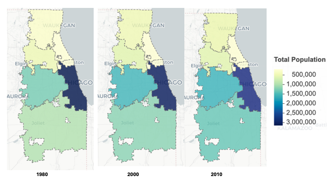{#fig-chicago-maps}

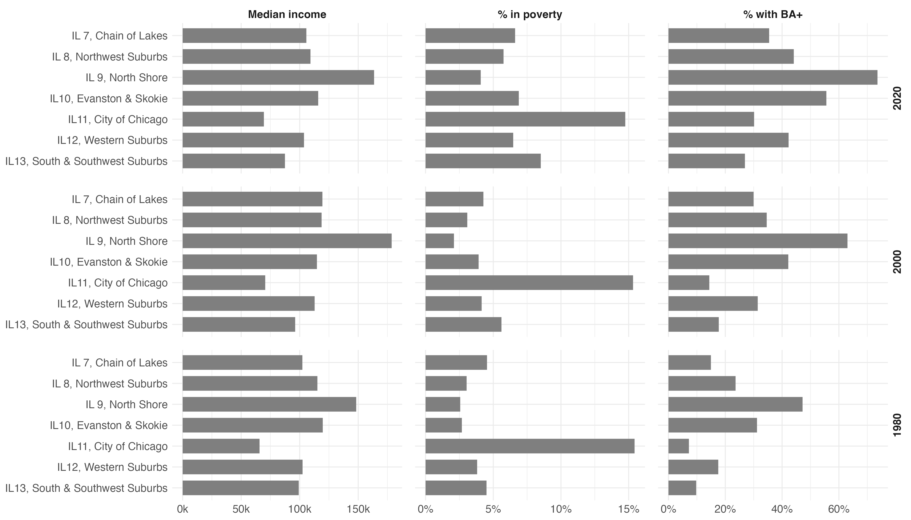{#fig-chicago-ses}

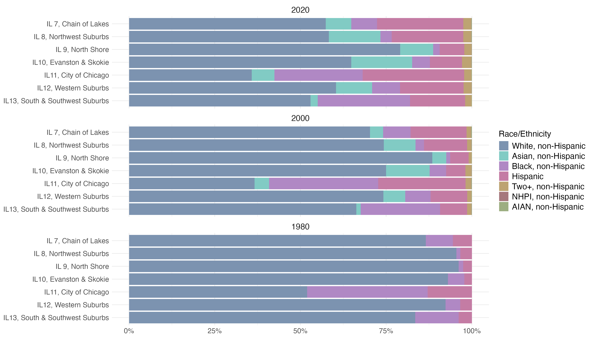{#fig-chicago-race}

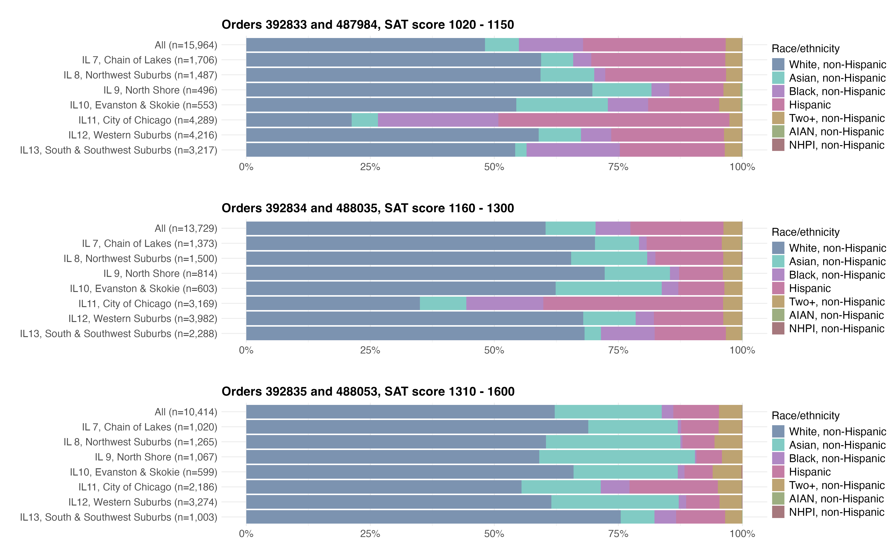{#fig-rq2-chicago-race-row-plot}

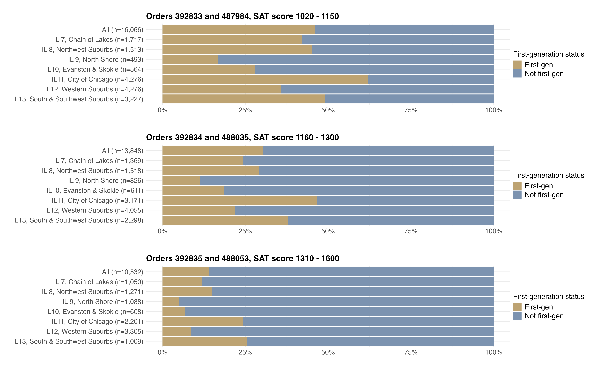{#fig-rq2-chicago-firstgen-row-plot}

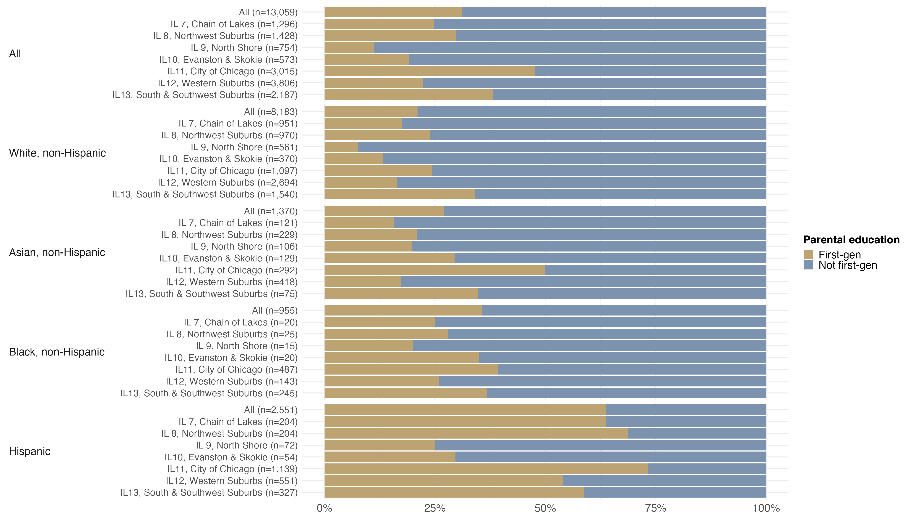{#fig-rq2b-chicago-order-392834-488035-race-by-firstgen}

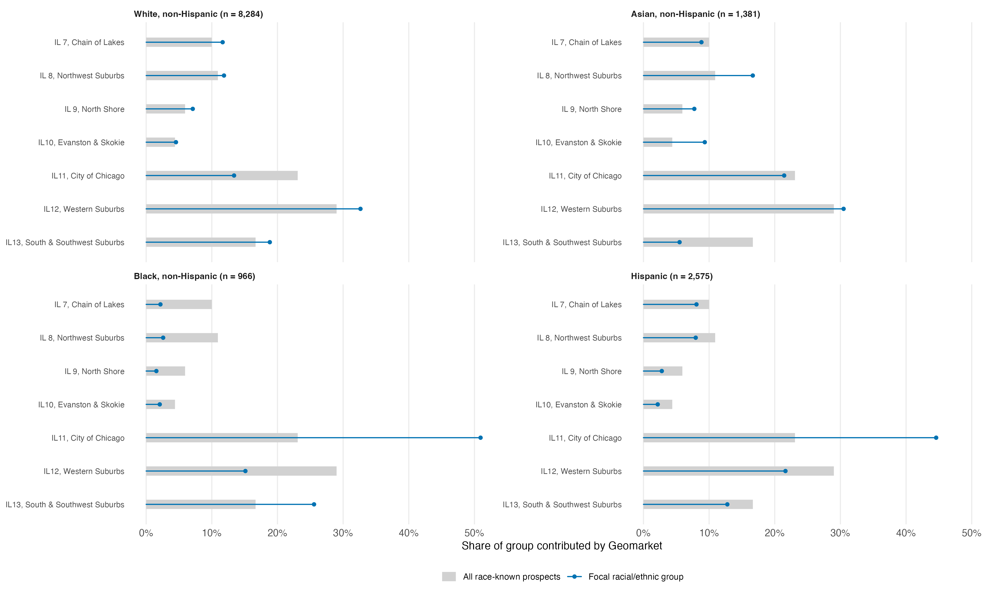{#fig-rq2-chicago-race-contribution-overlay-plot-392834-488035}

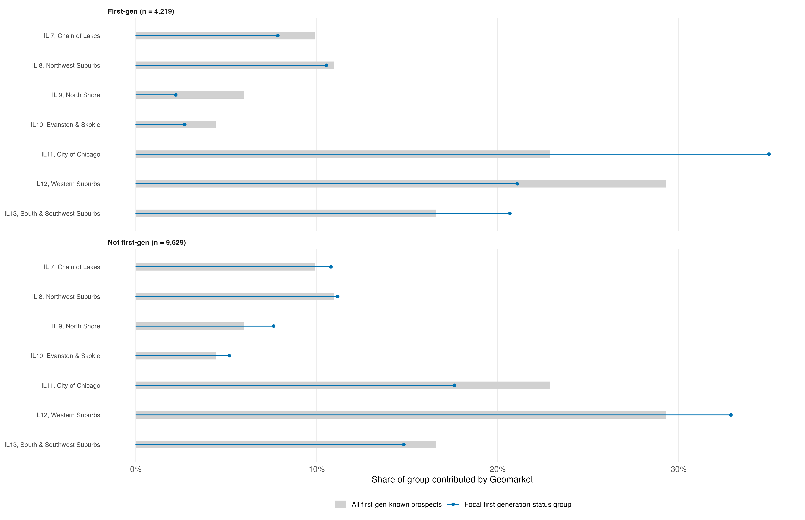{#fig-rq2-chicago-firstgen-contribution-overlay-plot-392834-488035}

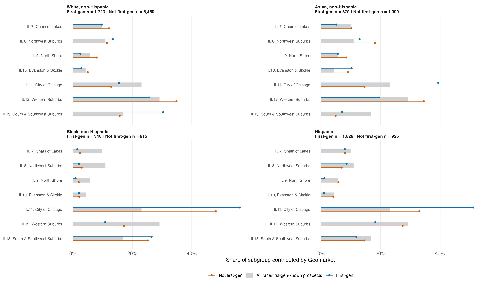{#fig-rq2-chicago-race-firstgen-contribution-plot-392834-488035}

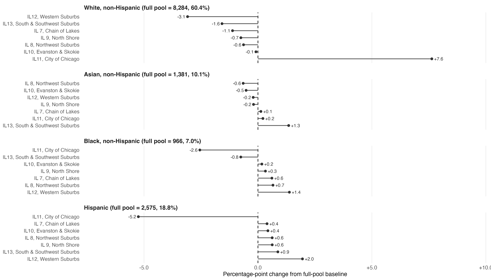{#fig-rq3-chicago-race-pp-exclusion-plot-order-392834-488035}

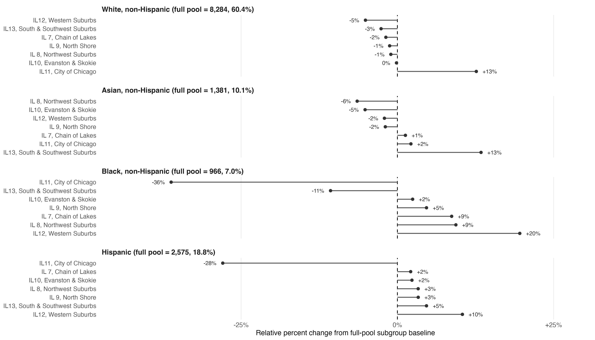{#fig-rq3-chicago-race-relative-exclusion-plot-order-392834-488035}

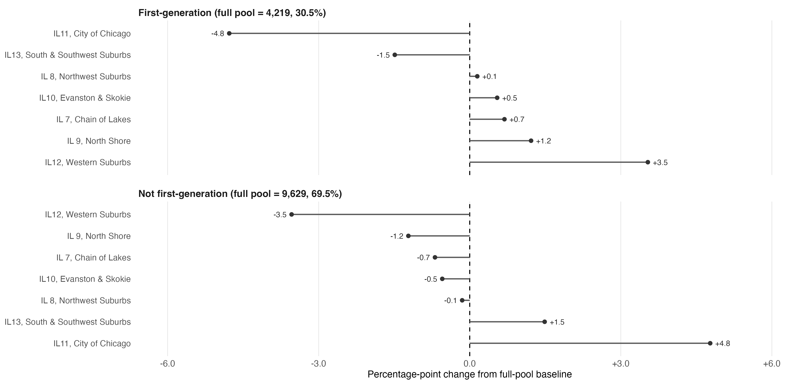{#fig-rq3-chicago-firstgen-pp-exclusion-plot-order-392834-488035}

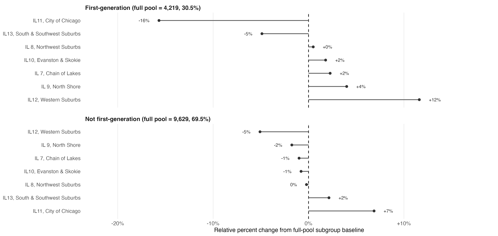{#fig-rq3-chicago-firstgen-relative-exclusion-plot-order-392834-488035}

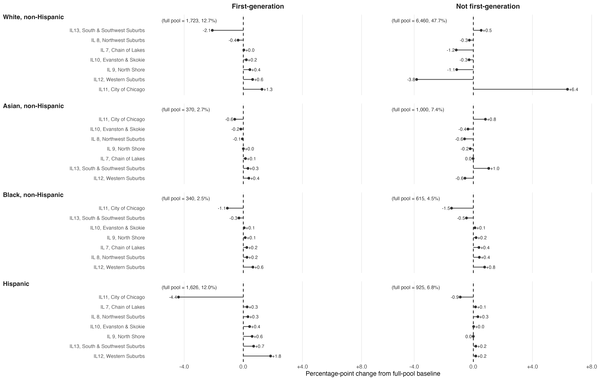{#fig-rq3-chicago-race-firstgen-pp-exclusion-plot-order-392834-488035}

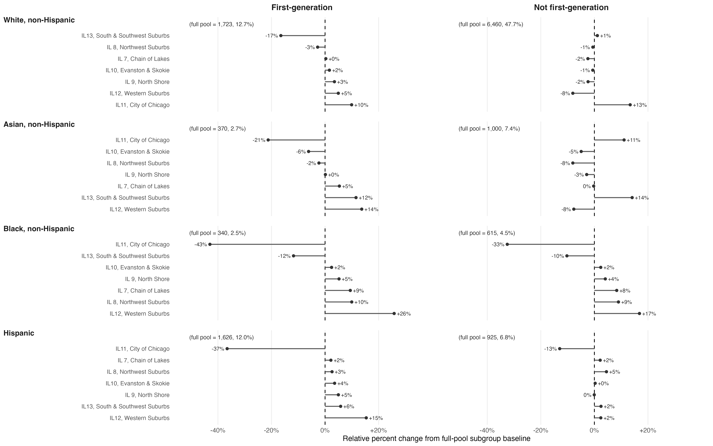{#fig-rq3-chicago-race-firstgen-relative-exclusion-plot-order-392834-488035}
